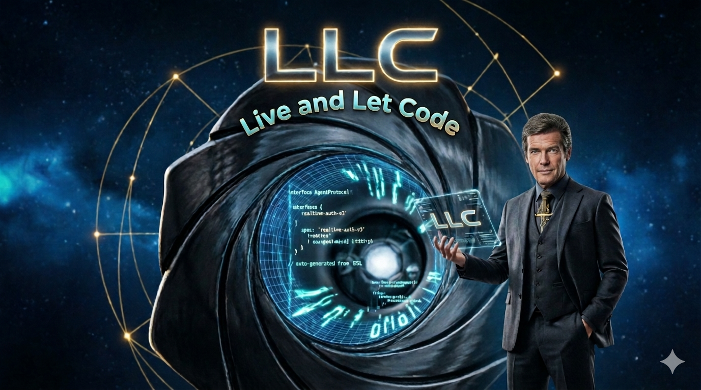

# Live and Let Code (LLC)

**Agentic Autonomous Development Methodology** | **Metodologia de Desenvolvimento Agentico Autônomo**

---

### 🇧🇷 Português

Live and Let Code (LLC) é uma metodologia open-source que estrutura o ciclo completo de construção de software — da ingestão de conhecimento de negócio ao deploy em produção — em **14 etapas principais + 5 auxiliares** com **gates de validação humana** em cada fase. **21 skills tool-agnostic** executáveis por qualquer cliente de IA terminal.

📘 **[Guia de Execução (PT-BR)](LLC_GUIDE.md)** — passo a passo completo  
📄 **[Especificação do Pipeline](llc-pipeline-design.md)** — design document

---

### 🇺🇸 English

Live and Let Code (LLC) is an open-source methodology that structures the complete software development lifecycle — from business knowledge ingestion to production deployment — into **14 main + 5 auxiliary steps** with **human validation gates** at every phase. **21 tool-agnostic skills** executable by any terminal AI client.

📘 **[Execution Guide (EN-US)](LLC_GUIDE.en.md)** — full step-by-step guide  
📄 **[Pipeline Specification](llc-pipeline-design.en.md)** — design document

---

### Princípios | Principles

| 🇧🇷 | 🇺🇸 |
|-----|-----|
| Documentação como código — todo artefato é versionável | Documentation as code — every artifact is versionable |
| Humano no controle — IA propõe, humano dispõe | Human in control — AI proposes, human decides |
| Tool-agnostic — any terminal AI client | A metodologia (skills Markdown, gates, artefatos) e independente de ferramenta. A implementacao de referencia usa Python 3.10+ para automacao. |
| Rastreabilidade total — da visão ao commit | Full traceability — from vision to commit |
| Paralelismo por design — PRPs auto-contidos | Parallelism by design — self-contained PRPs |

### 🚀 Quick Start (Thin Harness)

```bash
pip install click
python .ace/scripts/llc.py pipeline --from 0
```

### Pipeline

```
Ingestion → Conversion (Docling) ─👤─→ Vision + Modules ─👤─→ 7 Specs ─👤─→ PRDs ─👤─→ PRPs
─👤─→ Planning ─👤─→ Architecture ─👤─→ Tasks ─👤─→ Design System ─👤─→ Setup + Mock
─👤─→ Testing ─👤─→ Project Docs ─👤─→ User Guide ─👤─→ Execution
```

---

**[GitHub](https://github.com/jcneto25/Live-and-Let-Code)** | **MIT License**
