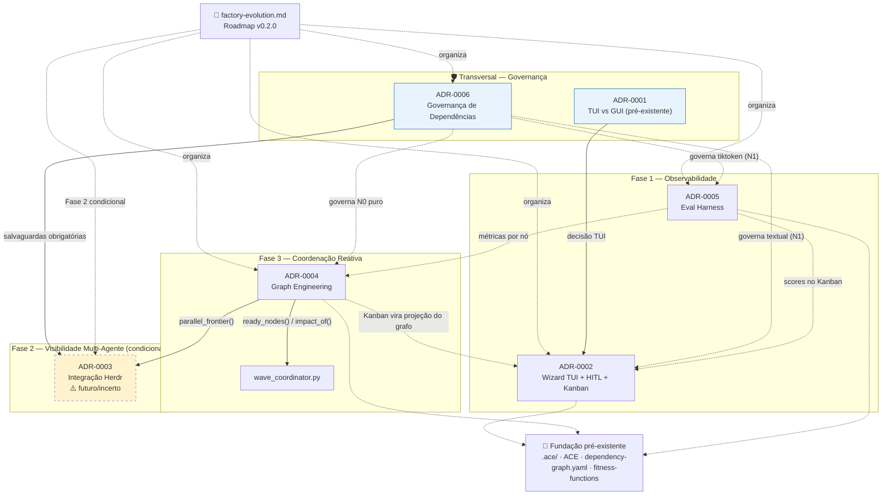
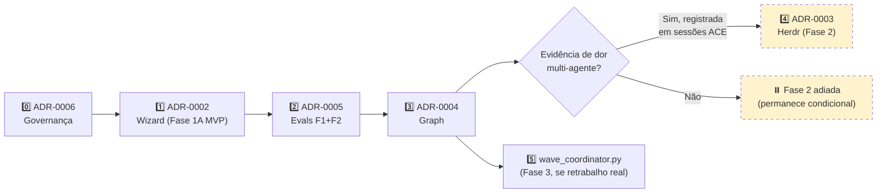

# 📋 Sumário Executivo: Evolução do LLC para Fábrica Agêntica

**Documento:** `docs/architecture/factory-evolution.md` v0.2.0 · **Data:** 2026-08-05 · **Status:** Proposto · **Audiência:** Decisores técnicos e de produto

---

## 1. O Desafio

O **Live and Let Code (LLC)** é uma metodologia agentica de desenvolvimento de software que já entrega paralelismo de execução (via worktrees), gates humanos e rastreabilidade. Porém, operadores de pipelines maiores enfrentam **dores reais de observabilidade e coordenação**:

- **Não enxergam o progresso consolidado** do pipeline (estado inferido indiretamente de arquivos).
- **Não medem a eficiência** das etapas (tokens, custo, regressão de qualidade).
- **Não coordenam reativamente** dependências que mudam durante a execução.
- **Não têm visibilidade** quando múltiplos PRPs rodam simultaneamente em worktrees.

Evoluir o LLC para uma **fábrica agêntica** significa entregar essas capacidades **sem quebrar** o que já funciona.

---

## 2. A Abordagem — Incremental, Condicional e Segura

**Princípio-guia:** *nenhuma ferramenta externa entra no núcleo sem que sua ausência degrade graciosamente.* Toda evolução é **opcional, removível e condicionada a evidência real de dor** — nunca por antecipação.

| Iniciativa | Entrega | Valor Principal | Natureza |
|---|---|---|---|
| **Governança de Dependências (ADR-0006)** | Política de licença, bus factor, degradação | Proteção jurídica e técnica | Fundação política |
| **Wizard + HITL + Kanban (ADR-0002)** | TUI orquestradora, feedback humano estruturado, quadro de fluxo | Visibilidade consolidada + decisão informada | Fase 1 — Observabilidade |
| **Eval Harness (ADR-0005)** | Tokens por etapa, quality score, regressão | Medição de eficiência e corretude | Transversal |
| **Graph Engineering (ADR-0004)** | Modelo de dependências, scheduler read-only | Coordenação e análise de impacto | Fase 3 — Coordenação |
| **Visibilidade Multi-Agente (ADR-0003)** | Visualização de PRPs paralelos | Observabilidade de execução paralela | Fase 2 — **condicional** |

---

## 3. Por Que Vale a Pena

| Benefício | Métrica Esperada |
|---|---|
| **Decisões humanas informadas** | Gates aprovados com score prévio (`QualityScore` + custo) |
| **Redução de retrabalho** | −20% em tokens desperdiçados em retries (detecção de regressão) |
| **Proteção contra degradação** | Alerta automático quando qualidade/custo de um step piora vs baseline |
| **Escalabilidade do operador** | 1 operador coordena múltiplos PRPs paralelos com quadro visual |
| **Baixo risco de adoção** | Núcleo Python puro + MIT; dependências externas removíveis |

---

## 4. Investimento Estimado

| Fase | Esforço | Pré-requisito | Desbloqueia |
|---|---|---|---|
| **Governança (ADR-0006)** | ~3 dias | Nenhum | Todas as demais |
| **Wizard MVP (ADR-0002 Fase 1A)** | 4 semanas | Governança | Visibilidade imediata |
| **Eval Harness (ADR-0005 F1+F2)** | 2 semanas | Wizard MVP | Medição de eficiência |
| **Graph Engineering (ADR-0004)** | 3 semanas | Wizard | Coordenação reativa |
| **Fase 2 (condicional)** | 2 semanas | Evidência de dor registrada | Paralelismo observável |
| **Total do núcleo** | **~12 semanas** | — | Fábrica agentica base |

> **Narrativa de investimento (GOV-003/R12):** o **~12 semanas** acima corresponde ao **núcleo de 1ª geração** — primeiro horizonte observável (Governança + Wizard MVP + Eval F1/F2 + Graph Engineering). O **~24 semanas** no PRP-MAP (linha "Total núcleo" = 18 PRPs) cobre o **programa completo**, adicionando Fase 2/3 condicionais (Wave Coordinator, Herdr/multi-agente) que podem ser postergadas sem reescrever o núcleo. As duas cifras não conflitam: 12 sem = entrega incremental, 24 sem = roadmap total.

---

## 5. Riscos Principais e Mitigações

| Risco | Mitigação |
|---|---|
| **Acoplamento a ferramentas instáveis** (ex.: pré-1.0, bus factor 1) | Governança obrigatória (ADR-0006): licença verificada, versão pinada, degradação graciosa testada |
| **Solução de problema inexistente** | Cada fase só avança com evidência registrada em sessões ACE |
| **Quebra da filosofia MIT/tool-agnostic** | Núcleo Python puro; ferramentas externas apenas opcionais e nunca no caminho crítico |
| **Over-metricação sem uso** | Cada métrica vinculada a uma decisão concreta (redução de retrabalho, alerta de regressão) |

---

## 6. O Que **Não** Vamos Fazer

- ❌ **Reescrever o núcleo** do pipeline ou adotar motores de workflow pesados (Temporal, K8s) — otimização prematura sem evidência.
- ❌ **Delegar decisões a um LLM Orchestrator** — contradiz o compromisso do LLC com determinismo (Early Commitment/Deterministic Replay).
- ❌ **Acoplar a uma ferramenta específica** (ex.: Herdr) — capacidades são descasadas de ferramentas; o ADR-0003 é condicional.
- ❌ **Substituir gates humanos por automação** — o humano permanece no controle; automação informa, nunca decide.

---

## 7. Próximo Passo Recomendado

**Ação imediata:** aprovar o ADR-0006 (Governança de Dependências) e iniciar a Fase 1A do Wizard (MVP em 4 semanas).

**Critério de progresso:** em 8 semanas, o LLC terá visibilidade consolidada do pipeline (Wizard + Kanban) e medição de custo por etapa (Evals), sem nenhuma dependência externa crítica e com todo o núcleo funcional via CLI puro.

---

**Referências técnicas completas:** ADR-0002, ADR-0004, ADR-0005, ADR-0006 · `docs/architecture/factory-evolution.md` v0.2.0

---


# LLC → Fábrica Agêntica: Proposta de Evolução Incremental

**Arquivo:** `docs/architecture/factory-evolution.md`

```yaml
---
document: factory-evolution.md
version: 0.2.0
status: revised
date: 2026-08-05
supersedes: factory-evolution.md v0.1.0
alignment: llc-pipeline-design.md v1.9.0
related_adrs:
  - ADR-0002   # Wizard TUI (Fase 1)
  - ADR-0004   # Graph Engineering (Fase 3)
  - ADR-0005   # Eval Harness (transversal)
  - ADR-0006   # Governança de Dependências Externas (Fase 2)
---
```

**Princípio-guia:** cada fase resolve uma dor comprovada; nenhuma fase introduz dependência que a fase seguinte não possa remover sem reescrever o núcleo.

---

## Registro de Mudanças

| Versão | Data | Mudanças |
|---|---|---|
| 0.1.0 | — | Proposta inicial |
| **0.2.0** | 2026-08-05 | Incorpora análise crítica: (1) paralelismo tratado como já existente via worktrees; (2) salvaguardas de dependência externa formalizadas e referenciadas ao ADR-0006; (3) Opção F (LLM Orchestrator) reclassificada como anti-padrão; (4) **Qualificação Socket API** na Fase 2; (5) **licença incluída no plano de revisão** com gatilhos de reavaliação imediata; (6) **critérios de aceite testáveis** na Fase 3; (7) alinhamento explícito com ADRs 0002/0004/0005/0006 |

---

## 1. Reformulação do Problema

O termo "fábrica agêntica" é ambíguo o suficiente para justificar qualquer arquitetura. Antes de escolher ferramentas, é preciso decompor a ambição em capacidades independentemente testáveis:

| Capacidade | Pergunta que resolve | O LLC v1.9.0 já resolve? |
|---|---|---|
| **Paralelismo de execução** | PRPs independentes rodam ao mesmo tempo sem colidir? | ✅ **Sim** — git worktrees automáticos (`initialize_session.py`, convenção `prp-{id}/wave-{n}`) |
| **Visibilidade de execução** | O operador vê, em tempo real, o que cada agente está fazendo? | ❌ Não — `.ace/index.json` é lido, não observado |
| **Coordenação de dependências** | O sistema sabe qual PRP pode começar antes de outro terminar? | ⚠️ Parcial — `DEPENDENCY_MATRIX.md` (Step 4) é estático, não reativo |
| **Resiliência a falha** | Uma sessão que crasha pode ser retomada sem perder trabalho? | ⚠️ Parcial — append-only preserva conteúdo; `index.json`/`context_seed` corrompidos exigem reparo manual (§8.6) |
| **Multi-projeto simultâneo** | Múltiplos produtos rodam LLC ao mesmo tempo, no mesmo operador? | ❌ Não — cada projeto é uma árvore `.ace/` isolada |
| **Gates humanos preservados** | Toda automação nova respeita "humano no controle"? | Restrição obrigatória para qualquer fase |

**Correção de premissa (crítica §5):** paralelismo de execução **já existe** via worktrees. O gap real está em **visibilidade e coordenação reativa** — não em "não ter paralelismo". Isso reduz o escopo e o risco da Fase 2: qualquer ferramenta externa traria *visibilidade sobre um paralelismo já existente*, não o paralelismo em si.

---

## 2. Princípio de Decisão para Toda a Proposta

> **Nenhuma ferramenta externa entra na camada de Fat Code (`.ace/scripts/`) ou no Thin Harness sem que sua ausência degrade graciosamente.** O LLC continua funcionando via CLI puro (`llc run --step N`) mesmo se toda ferramenta de UI/runtime for removida.

Aplicação direta do Thin Harness/Fat Skills ao próprio roadmap. Qualquer dependência externa deve satisfazer o **ADR-0006 (Governança de Dependências Externas)**: classificação por nível de acoplamento, licença verificada, bus factor documentado, versão pinada, degradação graciosa testada.

---

## 3. Fase 1 — Observabilidade (Wizard TUI)

**Objetivo:** responder "onde estou no pipeline?", "o que está bloqueado?" e "quanto custa cada etapa?" sem abrir 5 arquivos.

**Implementação:** ADR-0002 (Wizard TUI + HITL + Kanban) · ADR-0005 (Eval Harness, transversal).

### Escopo técnico
- **Framework:** Textual (Python puro, MIT, mesma stack do harness — sem nova linguagem de runtime). Dependência **N1**, registrada conforme ADR-0006.
- **Lê exclusivamente artefatos que já existem:** `.ace/index.json`, `.ace/config/gates.json`, `docs/planning/EXECUTION_WAVES.md`.
- **Read-only na v1** — a TUI não decide nada; apenas espelha o estado do harness.
- **Módulo `llc_wizard/data.py`** — camada de leitura desacoplada da TUI, reutilizável por qualquer front-end futuro (inclusive web).
- **Eval Harness (ADR-0005)** — instrumentação de tokens/custo por etapa; `QualityScore` e `EfficiencyScore` exibidos no Kanban.

### Critério de aceite
- Sidebar mostra os 23+2 steps com status (`pending`/`in_progress`/`gate_pending`/`completed`/`blocked`).
- Gate checklist interativo grava exatamente o mesmo `<gate_result>` que o fluxo manual já grava — **zero mudança de schema no ACE**.
- Fallback: se a TUI travar ou não estiver instalada, `llc run --step N` continua funcionando **sem regressão** (degradação graciosa testada).
- Kanban reflete múltiplos cards `RUNNING` quando há PRPs paralelos via worktrees (não assumir WIP=1 no nível de execução).

### Por que primeiro
Resolve a dor mais imediata com o menor raio de risco: se falhar, o único custo é "voltamos a olhar `index.json` na mão". Nenhum dado é reescrito; nenhuma dependência entra no harness.

### Não-escopo desta fase
Paralelismo de visualização, multi-projeto, orquestração automática. Deliberado — a Fase 1 não resolve o que a Fase 2 existe para resolver.

---

## 4. Fase 2 — Visibilidade Multi-Agente (condicional)

**Gate de entrada:** esta fase só se justifica se, após 4–6 semanas de uso da Fase 1, houver **evidência registrada em `.ace/sessions/`** de que múltiplos PRPs de uma mesma wave estão sendo executados manualmente em terminais separados sem coordenação visual — não por antecipação, mas por dor observada.

### Escopo técnico
- **Nova skill opcional:** `docs/skills/llc-wave-observability.md`.
- **Papel da ferramenta externa:** apenas visualização de panes já criados pelos worktrees existentes. Ela **não decide paralelismo** — o `EXECUTION_WAVES.md` (já gerado no Step 4) continua sendo a única fonte de verdade sobre quais PRPs podem rodar juntos.

### 🟡 Qualificação 1 — Modos de Integração: CLI vs Socket API

A integração com uma ferramenta externa pode ocorrer de dois modos, com riscos distintos:

| Modo | Descrição | Risco | Tratamento |
|---|---|---|---|
| **(a) Invocação de binário CLI** | O harness chama um comando externo e lê a saída | Baixo — acoplamento pontual | Preferido; degrada trivialmente se binário ausente |
| **(b) Socket API / protocolo** | O harness conecta a um socket/API para orquestrar panes | **Maior** — acoplamento de protocolo | Permitido apenas com tolerância explícita a falha |

> ⚠️ **Regra para o modo (b):** ferramentas como o Herdr expõem uma **Socket API**, que é mais que invocação de binário — é acoplamento de protocolo. Se usada, a skill **deve tolerar a ausência ou quebra da Socket API**, degradando para o comportamento atual. Especificamente:
> - **Feature detection** da Socket API antes de qualquer uso.
> - **Versão de protocolo esperada registrada** em `dependencies.yaml`.
> - **Timeout e fallback:** se a Socket API não responder em N segundos, a skill degrada para visualização passiva ou CLI puro.
> - **Nunca** a Socket API pode estar no caminho crítico de execução da wave.

### 🟡 Qualificação 2 — Salvaguardas de Dependência (licença no plano de revisão)

Toda ferramenta candidata a esta fase deve satisfazer o **ADR-0006** **antes** da adoção, não depois:

- **Licença compatível** com a distribuição MIT do LLC — verificação jurídica formal **no momento da integração**, consultando a fonte oficial.
- **Bus factor documentado** — se o mantenedor for uma única pessoa, a skill é marcada **experimental** no catálogo e vem com instrução explícita de fallback.
- **API pinada por versão** — o LLC nunca aponta para `latest`; toda integração referencia uma versão testada.
- **Plano de revisão periódico que inclui LICENÇA**, não apenas versão de API. Licenças mudam (o Herdr foi relicenciado recentemente); portanto:
  - A cada revisão periódica, **re-verificar a licença na fonte oficial**.
  - **Gatilhos de reavaliação imediata** (não esperam a revisão): mudança de licença permissiva→copyleft; anúncio de descontinuação; quebra de API/protocolo usada pelo LLC; vulnerabilidade crítica.
- **Sem gate humano delegado à ferramenta** — aprovação continua gravada exclusivamente pelo `finalize_session.py`, nunca por UI de terceiros.

### O que muda arquiteturalmente
Nada no Thin Harness. A ferramenta de visualização é estritamente uma **lente** sobre o que os worktrees já fazem — não um novo orquestrador.

---

## 5. Fase 3 — Coordenação Reativa (condicional, escopo restrito)

**Gate de entrada:** evidência de que `DEPENDENCY_MATRIX.md` estático (gerado uma vez no Step 4) causa **retrabalho real** porque o grafo de dependências muda no meio da execução da wave.

Diferente de propor um motor de workflow completo (Temporal/Airflow/K8s) como salto único, a Fase 3 é um **script novo em `.ace/scripts/`**, não uma nova plataforma de infraestrutura:

### `.ace/scripts/wave_coordinator.py`
- Lê `DEPENDENCY_MATRIX.md` + `.ace/index.json` em loop curto (polling, não event bus).
- Quando um PRP muda para `completed`, verifica se algum PRP bloqueado por ele agora está liberado.
- **Emite uma sugestão textual** (`docs/planning/EXECUTION_WAVES.md §próxima ação`) — **nunca dispara execução sozinho**.
- Continua respeitando: **humano decide** quando iniciar cada PRP liberado.
- **Fundamento:** o modelo de dependências pode ser derivado do **ADR-0004 (Graph Engineering)**, que fornece `ready_nodes()` e `impact_of()` como queries puras — mas o coordenador apenas **sugere**, nunca executa.

### 🟡 Qualificação 3 — Critérios de Aceite Testáveis

Para garantir que o coordenador permanece estritamente sugestivo (e não evolui para orquestrador automático), os seguintes critérios devem ser **verificáveis por teste**:

| # | Critério de aceite | Como testar |
|---|---|---|
| 1 | `wave_coordinator.py` **nunca invoca execução** (não chama `llc run`, não cria worktree, não dispara agente) | Teste que mocka/spy as funções de execução e asserta zero chamadas |
| 2 | A **única saída** é uma sugestão textual em `docs/planning/EXECUTION_WAVES.md §próxima ação` | Teste que asserta nenhum outro side-effect (nenhuma escrita fora desse arquivo) |
| 3 | O coordenador **não muta** `.ace/index.json` nem sessões | Teste de integridade ACE antes/depois |
| 4 | Se o grafo de dependências estiver ausente/corrompido, o coordenador **degrada graciosamente** (loga e sai, sem crash) | Teste com `DEPENDENCY_MATRIX.md` ausente |
| 5 | A decisão de iniciar um PRP liberado **permanece humana** (gate preservado) | Revisão de que não há auto-aprovação |

### Por que não Temporal/K8s/Event-driven como próximo passo
Essas arquiteturas resolvem **multi-tenant, multi-node, resiliência distribuída** — problemas que nenhuma evidência no `.ace/` atual sustenta. Introduzi-las agora seria otimização prematura sobre dor hipotética, e adicionariam infraestrutura (Postgres, servidor Temporal, cluster K8s) que contradiz o princípio "tool-agnóstico, terminal-first" — a proposta de valor central do LLC. Se o LLC um dia precisar operar multi-tenant como produto SaaS, essa é uma **decisão de reescrita de produto** — não uma evolução incremental da metodologia — e merece documento de design próprio quando (e se) essa necessidade for real.

---

## 6. O Que Fica Explicitamente Fora do Roadmap, e Por Quê

| Proposta descartada | Motivo |
|---|---|
| **Orchestrator LLM decidindo paralelização** | **Anti-padrão.** Contradiz Early Commitment/Deterministic Replay — reintroduz não-determinismo exatamente onde o LLC já eliminou. *(Reclassificado de "opção viável" para "anti-padrão" nesta revisão.)* |
| **Kubernetes-native** | Overhead operacional incompatível com "single-user, terminal-first" como caso de uso primário |
| **Broker de eventos (Kafka/NATS)** | Eventual consistency é incompatível com gates humanos síncronos — um gate não pode ser "eventualmente aprovado" |
| **Dashboard web como substituto do terminal** | Contradiz o princípio tool-agnóstico; se um dia existir, é um **consumidor adicional** de `llc_wizard/data.py`, nunca uma substituição |

> **Nota sobre LLM-as-judge (Evals):** distinto de LLM-as-orchestrator. O Eval Harness (ADR-0005) usa LLM apenas para **pontuar artefatos** (read-only), não para decidir execução ou paralelismo — portanto **não contradiz** Deterministic Replay.

---

## 7. Sequência de Decisão e Critérios de Saída

```
Fase 1 (Wizard + Evals)
   │
   │ critério de saída: uso real por ≥ 4 semanas +
   │ dor de multi-agente registrada em sessões ACE
   ▼
Fase 2 (Visibilidade multi-agente, condicional)
   │   • ferramenta pinada + registrada (ADR-0006)
   │   • fallback testado; Socket API tolerante a falha
   │   • licença re-verificada a cada revisão
   │
   │ critério de saída: DEPENDENCY_MATRIX estático
   │ causa retrabalho documentado em ≥ 3 sessões
   ▼
Fase 3 (wave_coordinator.py — sugestão reativa)
   │   • critérios testáveis §5 garantem modo sugestivo
   │   • nunca auto-executa
   │
   │ critério de saída: necessidade real de multi-tenant/
   │ multi-node com evidência de negócio, não de metodologia
   ▼
[Decisão de produto separada — fora do escopo deste documento]
```

---

## 8. Registro de Versão (para incorporar ao changelog do LLC)

| Campo | Valor |
|---|---|
| Documento | `docs/architecture/factory-evolution.md` v0.2.0 |
| Depende de | `llc-pipeline-design.md` §1.5 (Thin Harness), §8 (ACE), §9 (Impact Analysis) |
| Implementado por | ADR-0002 (Fase 1), ADR-0005 (Evals), ADR-0004 (Fase 3), ADR-0006 (Fase 2) |
| Não modifica | Schema de tags ACE, formato de `<gate_result>`, `dependency-graph.yaml` |
| Gate de aprovação sugerido | Novo — 👤 **Roadmap** — revisão humana da priorização entre fases, não apenas do conteúdo técnico |

---

## Síntese das Diferenças Centrais (v0.1.0 → v0.2.0)

1. **Paralelismo tratado como já resolvido** via worktrees — o gap real é visibilidade/coordenação, não execução.
2. **Adoção de ferramenta externa virou um processo com salvaguardas explícitas** (licença, bus factor, API pinada, degradação) formalizado no ADR-0006, em vez de decisão implícita.
3. **Salto direto para motor de workflow substituído por script incremental** (`wave_coordinator.py`) dentro de `.ace/scripts/`, mantendo a evolução na filosofia Thin Harness.
4. **Três qualificações incorporadas:** Socket API tolerante a falha; licença incluída no plano de revisão com gatilhos de reavaliação imediata; critérios de aceite testáveis garantindo que a Fase 3 permanece sugestiva.

---

# 🗺️ Mapa de Dependências — Ecossistema de Artefatos LLC

Consolidei todas as relações entre o roadmap, os ADRs, as issues e os artefatos pré-existentes. Incluí três representações complementares: o **grafo de dependências**, a **sequência de execução por fases**, e uma **versão em camadas** (ASCII) que independe de renderização.

---

## Legenda de Relações

| Símbolo | Significado |
|---|---|
| `═══▶` | **Implementa** (Issue implementa ADR) |
| `──▶` | **Depende de / pré-requisito** (forte) |
| `┄┄▶` | **Consome / alimenta** (fraca, enriquecimento) |
| `┈┈▶` | **Governa** (política transversal) |

---

## Mapa 1 — Grafo de Dependências entre Artefatos



> **Leitura do grafo:** setas sólidas = pré-requisitos fortes; tracejadas = consumo/enriquecimento. O **ADR-0003 (Herdr)** é o único nó "incerto" (tracejado) — só existe se a Fase 2 for justificada por evidência, e depende simultaneamente do **ADR-0004** (capacidade) e do **ADR-0006** (governança).

---

## Mapa 2 — Ordem de Execução Recomendada



---

## Mapa 3 — Visão em Camadas (ASCII)

```
┌─────────────────────────────────────────────────────────────────────┐
│  🎯  factory-evolution.md  (Roadmap v0.2.0 — visão de topo)           │
└───────────────────────────────┬─────────────────────────────────────┘
                                │ organiza
      ┌─────────────────────────┼─────────────────────────┐
      │                         │                         │
┌─────┴──────┐          ┌───────┴──────┐          ┌───────┴──────┐
│  FASE 1     │          │   FASE 3      │          │  FASE 2       │
│ Observabil. │          │ Coordenação   │          │ Visibilidade  │
│             │          │ Reativa       │          │ Multi-Agente  │
│ ADR-0002    │          │ ADR-0004      │          │ (condicional) │
│ Wizard+HITL │◀┄┄┄┄┄┄┄┄┄│ Graph         │┄┄┄┄┄┄┄┄▶│ ADR-0003      │
│ Kanban      │ projeção │ └▶ wave_      │ parallel │ Herdr ⚠️      │
│             │          │    coordinator│_frontier │               │
│ ADR-0005    │◀┄scores┄┄│               │          │               │
│ Eval Harness│──────────▶  métricas/nó  │          │               │
└─────┬──────┘          └───────┬──────┘          └───────┬──────┘
      │                         │                         │
      └────────────┬────────────┴────────────┬────────────┘
                   │ governados por           │ governado por
              ┌────┴────────────────────┐    │
              │ 🛡️ ADR-0006              │◀───┘
              │ Governança Dependências  │
              │ (licença·bus factor·pin) │
              └────┬────────────────────┘
                   │ assenta sobre
              ┌────┴────────────────────┐
              │ ADR-0001 (TUI vs GUI)    │
              └────┬────────────────────┘
                   │
┌──────────────────┴──────────────────────────────────────────────────┐
│  🧱  Fundação pré-existente: .ace/ · ACE · dependency-graph.yaml      │
│      fitness-functions · worktrees (paralelismo já existe)            │
└─────────────────────────────────────────────────────────────────────┘
```

---

## Ordem de Execução com Justificativa

| Ordem | Artefato | Fase | Justificativa | Issues |
|---|---|---|---|---|
| **0** | ADR-0006 | Governança | Fundação política: governa toda decisão de dependência subsequente. Baixo custo, alta proteção. Sem ele, a Fase 2 não tem critérios. | — |
| **1** | ADR-0002 | Fase 1 | Dor mais imediata (visibilidade). Read-only, baixo risco. Implementação: 1A MVP → 1B/1C HITL → v1.1 Kanban. | Issue Wizard |
| **2** | ADR-0005 | Fase 1 (transv.) | Instrumentação de custo + code evaluator. Enriquece o Kanban do Wizard com `QualityScore`/`EfficiencyScore`. Pode correr em paralelo com o Wizard. | Issue Evals |
| **3** | ADR-0004 | Fase 3 | Fundação de coordenação/paralelismo. Refina o Kanban (projeção do grafo). Desbloqueia `wave_coordinator.py` e (futuramente) a Fase 2. | Issue Graph |
| **4** | ADR-0003 | Fase 2 | **Condicional.** Só se houver evidência de dor multi-agente registrada em sessões ACE. Sujeito a todas salvaguardas do ADR-0006. | — (futura) |
| **5** | `wave_coordinator.py` | Fase 3 | Condicional ao retrabalho real do `DEPENDENCY_MATRIX` estático. Estritamente sugestivo (critérios testáveis). | — (futura) |

---

## Pontos Críticos do Grafo (o que desbloqueia o quê)

| Nó | Desbloqueia | Risco se atrasado |
|---|---|---|
| **ADR-0006** | Todas as decisões de dependência; Fase 2 | Sem ele, adota-se ferramentas sem critério |
| **ADR-0002 (`data.py`)** | Kanban, Evals (exibição), Graph (projeção) | Gargalo central da visualização |
| **ADR-0004 (`parallel_frontier`)** | `wave_coordinator.py`; ADR-0003 | Sem ele, coordenação reativa não existe |
| **ADR-0005 (F1 instrumentação)** | Toda análise de eficiência | Sem tokens medidos, não há `EfficiencyScore` |
| **ADR-0003** | Nada crítico — é folha condicional | Seu atraso/adamento **não bloqueia** nenhuma outra iniciativa |

> **Insight estratégico:** o **ADR-0003 (Herdr) é o único nó verdadeiramente opcional** — uma folha condicional que não bloqueia nada. Todos os demais (0006, 0002, 0005, 0004) têm valor intrínseco independente do Herdr. Isso confirma a correção de descasar capacidade↔ferramenta feita na reavaliação.

---

## Síntese Visual

- **Núcleo duro (sempre vale a pena):** ADR-0006 → ADR-0002 → ADR-0005 → ADR-0004.
- **Periferia condicional (só com evidência):** ADR-0003 (Herdr) e `wave_coordinator.py`.
- **Todos assentam** sobre a fundação pré-existente (ACE, fitness, worktrees) e são **governados** pelo ADR-0006.
- **Paralelismo já existe** (worktrees) — o ecossistema adiciona *visibilidade, medição e coordenação*, não execução.

---
