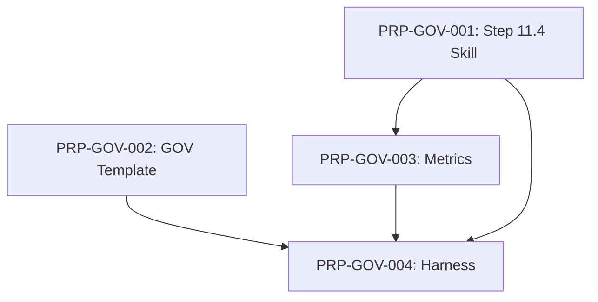

# Plano de Evolução da Metodologia — Governance Conversion

> **Versão:** 1.0 | **Data:** Julho 2026 | **Status:** Aprovado
> **Projeto:** Live and Let Code (LLC) — Metodologia | **Autor:** Equipe LLC
> **Referências:** `docs/article-parallel-llc.md`, `CONTEXT.md`, `llc-pipeline-design.md`

---

## 1. Visão Geral

### 1.1 Propósito

Este plano descreve a implementação das 7 prioridades identificadas no paralelo entre o artigo "Cheap Code, Costly Judgment" e o workflow LLC. O objetivo é institucionalizar o loop de **Governance Conversion** como componente explícito, rastreável e mensurável da metodologia.

### 1.2 Escopo

| Prioridade | Descrição | PRP | Onda | Status |
|------------|-----------|-----|------|--------|
| P1 | Step 11.4 Governance Conversion (skill + pipeline + gate) | PRP-GOV-001 | 1 | ✅ |
| P2 | Template GOV e diretório docs/governance/ | PRP-GOV-002 | 1 | ✅ |
| P3 | Distinção probabilístico/determinístico documentada | — | 1 | ✅ (CONTEXT.md) |
| P4 | Context injection por impacto (harness) | PRP-GOV-004 | 2 | ✅ |
| P5 | Métricas de governança | PRP-GOV-003 | 1 | ✅ |
| P6 | Autoridade de conversão definida | — | 1 | ✅ (CONTEXT.md) |
| P7 | Observabilidade agentica consolidada | — | Futuro | 📋 |

---

## 2. Ondas de Execução

### Onda 1: Núcleo do Governance Conversion

**PRPs:** PRP-GOV-001, PRP-GOV-002, PRP-GOV-003
**Pré-condição:** Nenhuma
**Paralelo:** 3 PRPs simultâneos
**Estimativa:** 2-3 dias
**Status:** ✅ Completa

| PRP | Nome | Status | Complexidade |
|-----|------|--------|:------------:|
| PRP-GOV-001 | Step 11.4 Governance Conversion | ✅ Complete | Média |
| PRP-GOV-002 | GOV Template e Diretório | ✅ Complete | Baixa |
| PRP-GOV-003 | Métricas de Governança | ✅ Complete | Média |

### Onda 2: Harness Integration

**PRPs:** PRP-GOV-004
**Pré-condição:** Onda 1 completa
**Paralelo:** 1 PRP
**Estimativa:** 3 dias
**Status:** ✅ Completa

| PRP | Nome | Status | Complexidade |
|-----|------|--------|:------------:|
| PRP-GOV-004 | Harness Integration para GOV Lifecycle | ✅ Complete | Média |

---

## 3. Matriz de Dependências

---

## 4. Definição de Done (Onda 1)

- [x] Step 11.4 documentado e executável via skill
- [x] GOV template disponível em `docs/governance/GOV-TEMPLATE.md`
- [x] Métricas `failure_to_control_lead_time` e `structural_failure_recurrence_rate` calculáveis via script
- [x] Terminologia consolidada em `CONTEXT.md`
- [x] Pipeline design reflete step 11.4

---

## 5. Revisões

| Versão | Data | Autor | Mudanças |
|--------|------|-------|----------|
| 1.0 | 2026-07-30 | Equipe LLC | Plano inicial aprovado via grilling session |
