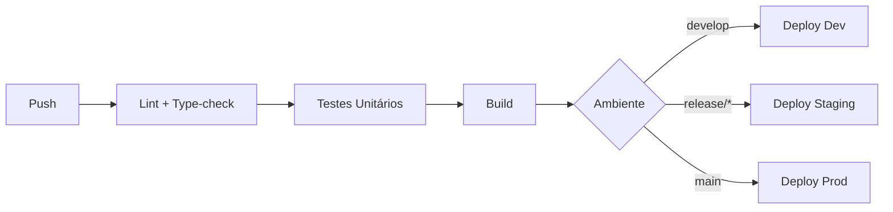

# LLC Skill: Step 10 — Documentos do Projeto

**Pipeline:** Live and Let Code (LLC)  
**Fase:** Project Documentation  
**Depende de:** Steps 5 (Arquitetura), 6 (Tasks), 7 (Design System), 8 (Mock Data), 9 (Testing Docs)  
**Mantenedor:** Equipe LLC

## 🛠️ Como usar esta Skill

1. Coloque este arquivo em `.claude/skills/` ou na pasta `docs/skills/` do projeto.
2. Invoque no chat usando: `@llc-step-10` ou "Execute a skill llc-step-10".

## 📋 Pré-requisitos

- [ ] `docs/architecture/ARCHITECTURE.md` — stack, ambientes, CI/CD (Step 5)
- [ ] `docs/planning/PLAN.md` — milestones e ondas (Step 4)
- [ ] `docs/planning/TASKS.md` — tarefas (Step 6)
- [ ] `docs/design/DESIGN_SYSTEM.md` — identidade visual (Step 7)
- [ ] `docs/testing/TESTING_GUIDE.md` — testes (Step 9)
- [ ] `docs/business/specs/visao_estrategica_e_negocio.md` — visão do sistema (Step 0.5)
- [ ] `docs/prd/executive_PRD.md` — sumário executivo (Step 2)
- [ ] `docs/prps/PRP-*.md` — PRPs com secao `user_docs` preenchida (Step 3)
- [ ] `docs/business/specs/perfis_permissoes.md` — perfis de usuario (Step 1)
- [ ] `docs/business/specs/workflows_bpmn.md` — fluxos do sistema (Step 1)
- [ ] `docs/business/specs/glossario.md` — glossario (Step 1)

---

## 🎯 PROMPT DE EXECUÇÃO

Você está executando a skill `llc-step-10` do pipeline LLC. Seu objetivo é gerar dois documentos fundamentais do projeto: o README.md (portal de entrada) e o DEPLOYMENT.md (estratégia de deploy).

### 1. Leia as Entradas

- `docs/architecture/ARCHITECTURE.md` — stack completo, diagramas C4, ambientes, CI/CD, monitoramento.
- `docs/planning/PLAN.md` — milestones, ondas, datas-alvo.
- `docs/planning/TASKS.md` — tarefas de deploy e infraestrutura.
- `docs/design/DESIGN_SYSTEM.md` — identidade visual (cores, tipografia para badges/shields).
- `docs/testing/TESTING_GUIDE.md` — quality gates e thresholds.
- `docs/business/specs/visao_estrategica_e_negocio.md` — objetivo do sistema, escopo.
- `docs/prd/executive_PRD.md` — sumário para stakeholders.

---

### 2. Gere o README.md

Salve em: **`README.md`** (raiz do projeto).

#### Estrutura Obrigatória

```markdown
# [NOME DO SISTEMA]

[Badge: versão] [Badge: licença] [Badge: status do build]

## 📋 Sobre

[2-3 parágrafos. O que o sistema faz, para quem, valor entregue.
Extraído da visão estratégica e PRD executivo.]

## 🏗️ Stack

| Camada | Tecnologia | Versão |
|--------|-----------|--------|
| Frontend | [framework] | [versão] |
| Backend | [runtime + framework] | [versão] |
| Banco | [SGBD] | [versão] |
| Infra | [cloud/on-premise + containers] | — |

[Extraído de ARCHITECTURE.md §2]

## 📁 Estrutura do Projeto

[Árvore de diretórios simplificada — principais pastas e propósito.
Extraída de ARCHITECTURE.md §7 — monorepo folder structure.]

## 🚀 Como Rodar

### Pré-requisitos
- [Ferramenta 1] ≥ [versão]
- [Ferramenta 2] ≥ [versão]

### Instalação
```bash
git clone [url]
cd [projeto]
npm install
```

### Desenvolvimento
```bash
npm run dev        # Inicia servidor de desenvolvimento
npm run mock       # Inicia MSW para dados mockados
```

### Testes
```bash
npm run test       # Testes unitários
npm run test:e2e   # Testes E2E
npm run coverage   # Relatório de cobertura
```

### Build
```bash
npm run build      # Build de produção
npm run start      # Inicia servidor de produção
```

## 🔐 Perfis de Acesso (Mock)

| Perfil | Email | Senha |
|--------|-------|-------|
| [Perfil P01] | [email mock] | 123456 |
| [Perfil P02] | [email mock] | 123456 |

[Extraído de mocks/data/users.json]

## 📚 Documentação

| Documento | Local | Descrição |
|-----------|-------|-----------|
| Visão Estratégica | `docs/business/specs/` | Objetivos, escopo, atores |
| PRD Executivo | `docs/prd/executive_PRD.md` | Requisitos para stakeholders |
| PRD Técnico | `docs/prd/PRD_tecnico_institucional.md` | Especificação técnica |
| Arquitetura | `docs/architecture/ARCHITECTURE.md` | Stack, C4, ADRs, CI/CD |
| Design System | `docs/design/DESIGN_SYSTEM.md` | Tokens, componentes, padrões |
| Guia de Testes | `docs/testing/TESTING_GUIDE.md` | Estratégia e templates |
| Deploy | `docs/DEPLOYMENT.md` | Ambientes e pipelines |
| Manual do Usuario | `docs/user-guide/USER_GUIDE.md` | Guia de uso em linguagem de usuario final |

## 🤖 Pipeline LLC

Este projeto segue a metodologia **Live and Let Code (LLC)**.
Etapas concluídas: [Steps 0 a 9] ✅
Próxima etapa: Execução (Step 11).

## 📄 Licença

[Licença do projeto]
```

---

### 3. Gere o DEPLOYMENT.md

Salve em: **`docs/DEPLOYMENT.md`**.

#### Estrutura Obrigatória

```markdown
# DEPLOYMENT.md — Estratégia de Deploy
## [NOME DO SISTEMA]

### 1. Ambientes

| Ambiente | URL | Infraestrutura | Branch | Deploy |
|----------|-----|---------------|--------|--------|
| **Dev** | `dev.[dominio]` | [Docker local / Cloud dev] | `develop` | Automático (push) |
| **Staging** | `staging.[dominio]` | [Cloud staging] | `release/*` | Manual (aprovação) |
| **Produção** | `[dominio]` | [Cloud produção] | `main` | Manual (tag + aprovação) |

### 2. Pipeline CI/CD

[Extraído de ARCHITECTURE.md §7 — pipeline CI/CD]



### 3. Variáveis de Ambiente

| Variável | Dev | Staging | Prod | Descrição |
|----------|-----|---------|------|-----------|
| `DATABASE_URL` | `sqlite:./dev.db` | `postgres://...` | `postgres://...` | String de conexão |
| `API_URL` | `http://localhost:3001` | `https://api.staging...` | `https://api...` | URL base da API |
| `AUTH_SECRET` | `dev-secret` | `[secreto]` | `[secreto]` | Chave JWT |
| `LOG_LEVEL` | `debug` | `info` | `warn` | Nível de logging |

> ⚠️ **NUNCA** commitar valores reais de staging/produção. Usar secrets manager ou
> variáveis de ambiente injetadas pelo pipeline.

### 4. Estratégia de Deploy

#### Dev
- Gatilho: push na branch `develop`
- Pipeline: lint → type-check → testes unitários → build → deploy
- Rollback: reverter commit

#### Staging
- Gatilho: criação de branch `release/*` OU aprovação manual
- Pipeline: lint → type-check → testes unitários → testes E2E → build → deploy
- Validação: smoke tests automatizados + aprovação manual
- Rollback: reverter tag de release

#### Produção
- Gatilho: tag semver (`v1.0.0`) + aprovação manual de 2 revisores
- Pipeline: lint → type-check → testes unitários → testes E2E → security audit → build → deploy canário (10%) → deploy completo
- Rollback: reverter para tag anterior. Tempo máximo: 5 minutos.

### 5. Estratégia de Rollback

| Cenário | Ação | Tempo Máximo |
|---------|------|-------------|
| Erro crítico pós-deploy | Reverter para versão anterior | 5 min |
| Degradação de performance | Reduzir tráfego para versão anterior (canário) | 2 min |
| Dados corrompidos | Restaurar backup + reverter deploy | 30 min |

### 6. Monitoramento Pós-Deploy

- **Health check:** `GET /health` — verificado a cada 30s por 5 min após deploy.
- **Métricas:** latency p95, error rate, CPU, memória.
- **Alertas configurados:**
  - Error rate > 1% nos primeiros 5 min → alerta crítico.
  - Latency p95 > 2x baseline → alerta de atenção.
  - Health check falha 3x consecutivas → rollback automático (se configurado).
- **Ferramentas:** [Datadog / Grafana / Prometheus / CloudWatch — conforme stack].

### 7. Comandos de Deploy

```bash
# Deploy Dev (automático via CI)
git push origin develop

# Deploy Staging
git checkout -b release/v1.2.0
git push origin release/v1.2.0
# Aprovar no dashboard de CI

# Deploy Produção
git tag v1.2.0
git push origin v1.2.0
# Aprovar no dashboard de CI (requer 2 revisores)
```

### 8. Checklist de Deploy

- [ ] Todos os testes passam no ambiente alvo
- [ ] Cobertura ≥ threshold definido
- [ ] Security audit sem vulnerabilidades críticas/altas
- [ ] Variáveis de ambiente verificadas
- [ ] Health check responde 200
- [ ] Smoke tests passam
- [ ] Rollback testado nos últimos 30 dias
```

---

### 4. Gere os Arquivos de Steering (CLAUDE.md + AGENTS.md)

Além do README.md e DEPLOYMENT.md, gere os arquivos de direção (steering files) que ensinam a IA sobre padrões e regras persistentes do projeto.

#### CLAUDE.md
- Use o template `docs/templates/CLAUDE_TEMPLATE.md`.
- Preencha com: stack, domínio, comandos, arquitetura, DB schema, restrições, CI/CD, integração ACE.
- Inclua `<!-- @include AGENTS.md -->` no topo para carregar regras compartilhadas.
- Salve na **raiz do projeto**: `CLAUDE.md`.

#### AGENTS.md
- Use o template `docs/templates/AGENTS_TEMPLATE.md`.
- Preencha com: nome do desenvolvedor, zonas de autonomia, protocolo epistêmico, TDD enforcement, handoff ACE, reviewer guidelines.
- Injete o **Master Prompt** (harness blocks) no placeholder `{{MASTER_PROMPT}}` — ver seção 5.1 abaixo.
- Salve na **raiz do projeto**: `AGENTS.md`.

**Relação:** CLAUDE.md = projeto (stack, domínio). AGENTS.md = desenvolvedor (como trabalha). Ambos referenciam a infraestrutura ACE.

### 5. Preencha o Documentation Index no AGENTS.md

No `AGENTS.md` gerado, localize o placeholder `{{DOCS_INDEX}}` e substitua pelo indice
comprimido de todos os artefatos LLC existentes no projeto.

#### Regras de preenchimento

1. **Formato fixo por linha:** `directory | file (KEYWORDS) | step | depends_on`
2. **KEYWORDS:** 3-5 palavras-chave em ingles, uppercase, que o agente encontrara
   em suas tarefas. Ex: `(STACK, C4, ADRS, SEGURANCA)` para ARCHITECTURE.md.
3. **step:** O step LLC que gerou o artefato. Ex: `Step 5`.
4. **depends_on:** Artefatos que este depende (nomes curtos, separados por virgula).
   Ex: `prd_tecnico, rnf`. Se nao depende de nenhum, use `-`.
5. **So inclua artefatos que EXISTEM.** Se um spec nao foi gerado, nao o liste.
6. **PRPs usam wildcard:** `PRP-*.md` — nao liste PRPs individuais.
7. **Ordem:** Agrupe por diretorio, mesma ordem do pipeline (Step 0 → Step 10.5).
8. **Diretorio:** Use caminho relativo a raiz do projeto. Ex: `docs/business/specs/`.

#### Template de saida (preencha apenas as linhas cujos artefatos existem)

```
docs/business/specs/ | visao_estrategica_e_negocio.md (VISAO, ESCOPO, ATORES, OBJETIVOS) | Step 0.5 | ingestion
docs/business/specs/ | glossario.md (TERMOS, SIGLAS, DEFINICOES, VOCABULARIO) | Step 1 | visao
docs/business/specs/ | requisitos_funcionais.md (FEATURES, COMPORTAMENTO, GHERKIN) | Step 1 | visao, glossario
docs/business/specs/ | requisitos_nao_funcionais.md (PERFORMANCE, SEGURANCA, RESTRICOES) | Step 1 | visao
docs/business/specs/ | regras_negocio.md (REGRAS, VALIDACOES, CONDICOES) | Step 1 | visao, glossario
docs/business/specs/ | workflows_bpmn.md (FLUXOS, PROCESSOS, DIAGRAMAS) | Step 1 | modulos
docs/business/specs/ | perfis_permissoes.md (PERFIS, ROLES, ACESSOS, RBAC) | Step 1 | visao
docs/business/specs/ | catalogo_integracoes.md (APIS, SERVICOS, EXTERNOS) | Step 1 | visao
docs/prd/ | executive_PRD.md (RESUMO, STAKEHOLDERS, VALOR) | Step 2 | visao, glossario
docs/prd/ | PRD_tecnico_institucional.md (STACK, REQUISITOS, API, DB) | Step 2 | specs
docs/prps/ | PRP-*.md (CONTRATO, IMPLEMENTACAO, GHERKIN, TESTES) | Step 3 | prd_tecnico
docs/architecture/ | ARCHITECTURE.md (STACK, C4, ADRS, CI/CD, SEGURANCA) | Step 5 | prd_tecnico, rnf
docs/design/ | DESIGN_SYSTEM.md (TOKENS, COMPONENTES, PADROES, A11Y) | Step 7 | arquitetura, perfis
docs/testing/ | TESTING_GUIDE.md (TDD, MOCKS, TEMPLATES, THRESHOLDS) | Step 9 | arquitetura, prps
docs/ | DEPLOYMENT.md (AMBIENTES, PIPELINE, ROLLBACK, VARIAVEIS) | Step 10 | arquitetura
docs/user-guide/ | USER_GUIDE.md (MANUAL, USUARIO, TUTORIAIS, NAVEGACAO) | Step 10.5 | prps, perfis
```

### 5.1. Injete o Master Prompt (Harness Blocks) no AGENTS.md

No `AGENTS.md` gerado, localize o placeholder `{{MASTER_PROMPT}}` e substitua pelo bloco
`MASTER_PROMPT:BEGIN..END` de `docs/templates/MASTER_PROMPT_TEMPLATE.md`.

#### Regras de preenchimento

1. **Preencha os placeholders** do bloco com os valores do projeto:
   `{{STACK}}`, `{{LINT_CMD}}`, `{{BUILD_CMD}}`, `{{ARCH_CHECK_CMD}}`, `{{TEST_CMD}}`, `{{COVERAGE_CMD}}`
   (use a tabela "Adaptação por Stack" do template — mesma matriz do Step 10a).
2. **Não edite as regras** dos 5 harness blocks (SECURITY, ARCHITECTURE, CLEAN_CODE, TDD, DEVOPS) —
   elas são resumos executáveis das skills 5d, 5a, 5c, 9a e 10a. Mudança de regra = mudança na skill de origem.
3. **Remova referências a enforcement inexistente:** se o projeto não tem `fitness-functions.py` ou
   pre-commit hooks instalados, mantenha a regra mas remova a referência entre parênteses ao check.
4. **Gates obrigatórios:** os 5 gates (lint, build, arch:check, test, coverage) devem apontar para
   comandos que EXISTEM no projeto. Gate sem comando disponível = remova a linha e registre em dívida técnica.

### 6. Validação Cruzada

Após gerar ambos os documentos, verifique:

- README.md referencia DEPLOYMENT.md?
- DEPLOYMENT.md referencia ARCHITECTURE.md para detalhes?
- Comandos no README correspondem aos scripts definidos nas tarefas?
- URLs de ambiente no DEPLOYMENT.md são consistentes com a arquitetura?
- Variáveis de ambiente listadas cobrem todos os serviços?

---

## ⚠️ REGRAS CRÍTICAS

1. **README é porta de entrada:** Deve permitir que um novo desenvolvedor configure e rode o projeto em ≤ 10 minutos.
2. **DEPLOYMENT é operacional:** Deve permitir que um DevOps execute deploy/rollback sem conhecimento prévio do projeto.
3. **Dados sensíveis:** NUNCA incluir secrets, tokens ou credenciais reais. Usar placeholders `[secreto]`.
4. **Consistência:** README, DEPLOYMENT e ARCHITECTURE.md devem concordar em stack, URLs e comandos.
5. **Badges:** Gerar badges para build status, coverage, license (usar shields.io).
6. **Idempotência:** Verifique existência dos arquivos antes de sobrescrever.

---

## 📤 SAÍDA ESPERADA E FINALIZAÇÃO

Após gerar os 2 documentos, **PARE** e apresente:

1. **README.md:** Estrutura das seções geradas, badges incluídos, links de documentação.
2. **DEPLOYMENT.md:** Ambientes definidos, estratégia de deploy por ambiente, checklist.
3. **Consistência:** Todos os comandos do README funcionam com os scripts do projeto?
4. **Variáveis:** Lista de variáveis de ambiente documentadas. Alguma ficou de fora?
5. **Documentation Index:** O indice comprimido foi preenchido no AGENTS.md?
   Todas as keywords cobrem os dominios do projeto? Algum artefato existente ficou de fora?
6. **Master Prompt:** Os 5 harness blocks foram injetados no `{{MASTER_PROMPT}}` do AGENTS.md?
   Os comandos dos gates obrigatorios (lint, build, arch:check, test, coverage) existem e funcionam no projeto?
7. **Consistencia:** Todos os comandos do README funcionam com os scripts do projeto?

**Este é o último passo antes da Execução (Step 11).**

---

### 6. Proximo Passo: Manual do Usuario

Apos a aprovacao do **Gate 11**, execute a skill `llc-user-guide` para gerar o esqueleto do manual do usuario:

```
Execute a skill docs/skills/llc-user-guide.md
```

A skill `llc-user-guide` gera a estrutura base do manual em `docs/user-guide/` com:
- Indice de paginas (extraido da secao `user_docs` de cada PRP)
- Guias por perfil de usuario
- Visao geral do sistema em linguagem de usuario final

A validacao do esqueleto ocorre no **Gate 11.5**. Apos aprovacao, siga para o Step 11 (Execucao), onde cada PRP preenchera suas paginas de manual incrementalmente.
