# Live and Let Code (LLC) — Pipeline Design Specification

**Version:** 1.8.0
**Date:** July 25, 2026  
**Status:** Design Approved  
**Project:** Live and Let Code (LLC) — Agentic Autonomous Development Methodology  
**Author:** LLC Team  

> 📄 Portuguese version: [`llc-pipeline-design.md`](llc-pipeline-design.md)

---

## 1. Overview

### 1.1 What is LLC

Live and Let Code (LLC) is an agentic software development methodology that structures the complete build cycle — from business knowledge ingestion to production deployment — into discrete steps, each with well-defined inputs, outputs, templates, and human validation gates.

### 1.2 Core Principles

1. **Documentation as code:** Every artifact is a versionable file (.md, .json, .yaml). Nothing lives only in external tools.
2. **Human in control:** No step advances without explicit human validation. AI proposes, human decides.
3. **Tool-agnostic:** The methodology defines the process, not the tools. Any terminal AI client can execute the skills.
4. **Full traceability:** Every artifact references its origin. From strategic vision to PRP, from PRP to task, from task to commit.
5. **Parallelism by design:** PRPs are self-contained contracts enabling parallel execution in independent worktrees.

### 1.3 Document Structure Summary

This document specifies:

- The LLC directory architecture (§2)
- The complete pipeline with 23 pipeline steps + 2 delta steps (§3)
- The skills catalog (§4)
- The agentic prototyping subflow (§5)
- The human gate system (§6)
- The ACE cross-session context system (§8)
- The traceability and impact analyzer (§9)

> **📘 Practical guide:** For step-by-step execution, LLM operation modes, practical tips, and
> Thin Harness usage, see [`LLC_GUIDE.en.md`](LLC_GUIDE.en.md). This document is the technical
> specification; the guide is practical execution. Also see [`FAQ.en.md`](FAQ.en.md) for conceptual questions.

### 1.4 5-Layer Architecture

LLC is organized into 5 conceptual layers from foundation to delivery:

| Layer | Manages | LLC Mechanisms |
|-------|---------|----------------|
| **1. Context** | Context window, session continuity, token compression | ACE `<context_seed>` (~300 tokens, 93% reduction), Document Hierarchy in AGENTS.md, compressed documentation index, prompt caching strategy, append-only sessions |
| **2. Knowledge** | Domain artifacts, specifications, architectural decisions | Strategic vision, 7 specs (glossary, FR, NFR, business rules, BPMN, profiles, integrations), PRDs (executive + technical), PRPs, ARCHITECTURE.md (C4 + ADRs), DESIGN_SYSTEM.md, USER_GUIDE.md, `<learning_point>` |
| **3. Agents** | Who executes, how they reason, with which rules | AGENTS.md (epistemic protocol, autonomy zones, TDD, ACE handoff), per-step roles (analyst, spec writer, architect, designer, planner, dev, QA, tech writer), Grill Me, CODE-REVIEW guidelines |
| **4. Workflows** | Pipeline, validation gates, orchestration | 23 pipeline steps + 2 delta, 26 human gates + visual checkpoint, `<gate_result>`, execution waves, PRRS (7 analysis prisms), dependency matrix, impact-analyzer.py |
| **5. Delivery** | Parallel execution, structural quality, deployment | Auto git worktrees (Step 11), code-health.py (4 metrics), mock data layer (MSW), CI/CD pipeline, DEPLOYMENT.md, coverage thresholds |

```
┌──────────────────────────────────────────────────────────┐
│ 5. DELIVERY    ← parallelism, quality, deploy            │
├──────────────────────────────────────────────────────────┤
│ 4. WORKFLOWS   ← pipeline, gates, orchestration          │
├──────────────────────────────────────────────────────────┤
│ 3. AGENTS      ← roles, epistemic protocol, rules        │
├──────────────────────────────────────────────────────────┤
│ 2. KNOWLEDGE   ← specs, PRDs, PRPs, architecture         │
├──────────────────────────────────────────────────────────┤
│ 1. CONTEXT     ← window, continuity, compression         │
└──────────────────────────────────────────────────────────┘
```

Each layer depends on the one below: without well-managed context, knowledge won't fit in the window; without structured knowledge, agents have no direction; without well-instructed agents, workflows produce no quality; without orchestrated workflows, delivery is unreliable.

### 1.5 Thin Harness — Orchestration

The **Thin Harness** (`llc`) is the orchestration layer connecting the 5 architectural layers. It's a Python CLI (~390 lines) that automates each step's lifecycle: init session → load skill → invoke agent → gate check → finalize session.

The harness is "thin" by design: it does not implement tool-calling, does not define rules, does not teach the model. It only connects the pieces that already exist.

**Optimizations integrated into the harness (v1.5.0):**

| Module | Function | Token Reduction |
|--------|---------|:---------------:|
| **Early Commitment** (`llc_classify.py`) | Classifies the task into 4 types BEFORE execution, collapsing the agent's search space | — |
| **Deterministic Replay** (`llc_replay.py`) | Replays approved execution paths for tasks of the same classification | ~99% per repeated task |
| **Replay Stats** (`replay_stats.py`) | Metrics dashboard: hit rate, success rate, token savings | — |

```
FAT SKILLS (Markdown)     ← docs/skills/ (23 files)
     ↑
THIN HARNESS (Python)     ← .ace/scripts/llc.py + llc_harness.py (~390 lines)
     ↑  + llc_classify.py + llc_replay.py (Early Commitment + Replay)
FAT CODE (Python)         ← .ace/scripts/ (7 ACE scripts)
     ↑
AI CLIENT                 ← Claude Code, opencode, Codex, Cursor...
```

**Main commands:**

| Command | Action |
|---------|--------|
| `llc run --step 5` | Execute a complete step |
| `llc pipeline --from 0` | Full pipeline (stops at gates) |
| `llc session start --step 5` | Start manual session |
| `llc session end --approve` | End manual session |
| `llc status` | Pipeline progress |

> **Enforcement:** the harness runs the init → agent → finalize cycle, but does not force the
> agent to go through it. How to **guarantee** sessions are recorded in `.ace` (advisory layers +
> a deterministic pre-commit + per-client hooks) is documented in
> [§8.7](#87-guaranteed-session-registration-enforcement).

---

## 2. Directory Architecture

```
project-root/
├── CLAUDE.md                                   # [OUTPUT] Project steering file (Step 10)
├── AGENTS.md                                   # [OUTPUT] Developer steering file (Step 10)
├── README.md                                   # Entry point (Step 10)
│
├── docs/
│   ├── DEPLOYMENT.md                           # Deploy strategy (Step 10)
│   │
│   ├── templates/                              # Global templates
│   │   ├── CLAUDE_TEMPLATE.md
│   │   ├── AGENTS_TEMPLATE.md                  # PT (default)
│   │   ├── AGENTS_TEMPLATE.en.md               # EN mirror
│   │   └── MASTER_PROMPT_TEMPLATE.md           # [Action 7] Master Prompt — 5 harness blocks (28 rules) injected into AGENTS.md
│   │
│   ├── business/                               # Business hub
  │   │   ├── ingestion/                          # [INPUT] Raw user docs
  │   │   │   └── converted/                      # [OUTPUT] Markdown files (Step 0.1)
  │   │   ├── specs/                              # [OUTPUT] 7 specs + vision + modules
  │   │   └── Template_Especificacao_Modulo.md    # Module template
│   │
│   ├── prd/                                    # PRDs (templates + generated)
│   │   ├── template_prd_executivo_institucional.md
│   │   ├── template_prd_tecnico_institucional.md
│   │   ├── executive_PRD.md                    # [OUTPUT]
│   │   └── PRD_tecnico_institucional.md        # [OUTPUT]
│   │
│   ├── prps/                                   # PRPs (template + generated)
│   │   ├── PRP_TEMPLATE.md
│   │   └── PRP-*.md                            # [OUTPUT]
│   │
│   ├── planning/                               # Planning (templates + generated)
│   │   ├── PLAN_TEMPLATE.md, TASKS_TEMPLATE.md
│   │   ├── EXECUTION_WAVES_TEMPLATE.md, DEPENDENCY_MATRIX_TEMPLATE.md
│   │   └── *.md                                # [OUTPUT]
│   │
│   ├── architecture/                           # Architecture (template + generated)
│   │   ├── ARCHITECTURE_TEMPLATE.md
│   │   └── ARCHITECTURE.md                     # [OUTPUT]
│   │
│   ├── design/                                 # Design System (master + generated)
│   │   ├── Design_System_Master.md
│   │   └── DESIGN_SYSTEM.md                    # [OUTPUT]
│   │
│   ├── testing/                                # Testing (templates + generated)
│   │   ├── TESTING_GUIDE_TEMPLATE.md
│   │   ├── COVERAGE_BASELINE_TEMPLATE.md
│   │   ├── COVERAGE_PROGRESS_TEMPLATE.md
│   │   └── *.md                                # [OUTPUT]
│   │
│   ├── skills/                                 # LLC Skills (tool-agnostic — 23 files)
│   │   ├── llc-step-0-greenfield.md
│   │   ├── llc-step-0-1.md
│   │   ├── llc-step-0-5.md
│   │   ├── llc-step-1.md
│   │   ├── llc-step-2.md
│   │   ├── llc-step-3.md
│   │   ├── llc-step-4.md
│   │   ├── llc-step-5.md
│   │   ├── llc-step-5d-secure-by-design.md
│   │   ├── llc-step-6.md
│   │   ├── llc-step-7.md
│   │   ├── llc-step-8.md
│   │   ├── llc-step-9.md
│   │   ├── llc-step-10.md
│   │   ├── llc-user-guide.md
  │   │   ├── llc-step-11-security.md
  │   │   ├── llc-step-11-owasp-security.md
  │   │   ├── llc-step-12-null-safety.md
  │   │   ├── llc-subflow-prototyping.md
  │   │   ├── llc-ace-context.md
  │   │   ├── llc-code-health.md
  │   │   └── llc-impact-analyzer.md
│   │
│   └── [9 spec templates].md                   # Templates (Step 0.5-1)
│
├── .ace/                                         # ACE — Session history + Infra
│   ├── dependency-graph.yaml                     # Dependency graph (traceability)
│   ├── index.json                                # Session index
│   ├── sessions/                                 # Append-only sessions
│   │   └── YYYY-MM-DD-NNN.md
│   ├── memory/                                   # Cross-session knowledge
│   │   ├── learning_points.md
│   │   └── architecture.md
│   ├── scripts/                                  # ACE Scripts
│   │   ├── initialize_session.py
│   │   ├── finalize_session.py
│   │   ├── promote-learning-points.py
│   │   ├── validate-tags.py
│   │   ├── impact-analyzer.py
│   │   ├── code-health.py
│   │   ├── llc.py                                # [1.5.0] Thin Harness CLI
│   │   ├── llc_harness.py                        # [1.5.0] Harness orchestrator
│   │   ├── llc_classify.py                       # [1.5.0] Early Commitment classifier
│   │   ├── llc_replay.py                         # [1.5.0] Deterministic Replay engine
│   │   ├── replay_stats.py                        # [1.5.0] Replay metrics dashboard
│   │   ├── fitness-functions.py                   # [1.7.0] Fitness Functions (40 checks: architecture, clean code, deep clean, security, UX)
│   │   ├── pre-commit.sh
│   │   └── llm-validation.sh                      # [Action 8] Post-generation self-validation (8 checks)
│   ├── config/                                    # [1.5.0] Config files
│   │   └── gates.json
│   ├── cache/                                     # [1.5.0] Replay scripts cache
│   │   └── {type}.json
│   ├── logs/                                      # [1.5.0] Replay event logs
│   │   └── replay.jsonl
│   ├── worktrees/                                 # Git worktree isolation (Step 11)
│   │   └── {session_id}/
│   └── templates/
│       └── session.template.md
│
├── .pre-commit-config.yaml                       # ACE validation + test gate + LLM self-validation on commit
│
├── mocks/                                       # Mock data layer (Step 8)
│   ├── data/        (users.json + entities)
│   ├── handlers/    (auth.ts + module handlers)
│   ├── browser.ts
│   └── server.ts
│
└── src/                                         # Source code (Step 11 + subflow)
    ├── app/
    ├── components/
    └── tokens/
```

### Naming Conventions

| Layer | Prefix | Example |
|-------|--------|---------|
| LLC Methodology | `LLC_` | `LLC_TESTING_GUIDE.md` |
| User Templates | `template_` | `template_visao_estrategica_e_negocio.md` |
| Generated Artifacts | descriptive name | `docs/business/specs/glossary.md` |
| Modules | `MOD-[SIGLA]-[NNN]_[name]` | `MOD-PLN-001_annual_planning.md` |
| PRPs | `PRP-[NNN]-[name]` | `PRP-001-auth.md` |
| Skills | `llc-step-[N]` or `llc-subflow-[name]` | `llc-step-0-5.md` |

---

## 3. Pipeline

### 3.1 Flow

```mermaid
graph TD
    START{Prior documentation?} -->|Yes| S0[Step 0: User loads raw docs]
    START -->|No| S0GF[Step 0-Greenfield: Structured Interview]
    S0GF --> S05
    S0 --> S01[Step 0.1: Docling → Markdown]
    S01 --> S05[Step 0.5: AI → Vision + Module Specs]
    S05 --> G1{👤 Gate 1}
    G1 -->|approved| S1[Step 1: AI → 7 Specs]
    S1 --> G2{👤 Gate 2}
    G2 -->|approved| S2[Step 2: AI → PRDs]
    S2 --> G3{👤 Gate 3}
    G3 -->|approved| S3[Step 3: AI → PRPs]
    S3 --> G4{👤 Gate 4}
    G4 -->|approved| S4[Step 4: AI → Planning]
    S4 --> G5{👤 Gate 5}
    G5 -->|approved| S5[Step 5: AI → Architecture]
    S5 --> G6{👤 Gate 6}
    G6 -->|approved| S5D[Step 5d: Secure-by-Design]
    S5D --> G5D{👤 Gate 5d}
    G5D -->|approved| S6[Step 6: AI → Tasks]
    G5D -->|rejected| S5D
    S6 --> G7{👤 Gate 7}
    G7 -->|approved| S7[Step 7: AI → Design System]
    S7 --> G8{👤 Gate 8}
    G8 -->|approved| S8[Step 8: AI → Setup + Mock Data]
    S8 --> G9{👤 Gate 9}
    G9 -->|approved| S9[Step 9: AI → Testing Docs]
    S9 --> G10{👤 Gate 10}
    G10 -->|approved| S10[Step 10: AI → Project Docs]
    S10 --> G11{👤 Gate 11}
    G11 -->|approved| S105[Step 10.5: User Guide Skeleton]
    S105 --> G115{👤 Gate 11.5}
    G115 -->|approved| S11SEC["Step 10.6: Security Audit (SCA + SAST + Secrets)"]
    S11SEC --> GSEC{👤 Gate 11-SEC}
    GSEC -->|approved| S12NULL["Step 10.7: Null Safety (Data Contracts)"]
    GSEC -->|rejected| S11SEC
    S12NULL --> G12NULL{👤 Gate 12-NULL}
    G12NULL -->|approved| S11[Step 11: LLC Execution]
    G12NULL -->|rejected| S12NULL
    S11 --> BACK["Non-UI PRPs → direct agent"]
    S11 --> UI["UI PRPs → Subflow F1-F6"]
    UI --> F4[F4: Hi-Fi]
    F4 --> CV{🔴 VISUAL CHECKPOINT}
    CV -->|approved| F5[F5: Code]
    F5 --> F6[F6: Validation]
    BACK --> QA[QA Checkpoints]
    F6 --> QA
    QA --> DEPLOY[Deploy]
```



### 3.2 Steps Table

| # | Name | Input | Output | Templates | Gate |
|---|------|-------|--------|-----------|------|
| 0 | Ingestion | User docs | `business/ingestion/` | — | — |
| 0-GF | Greenfield (alternative) | User interview | `ingestion/converted/` (interview .md) | — | — |
>
> **Note on 0-GF:** The greenfield flow replaces Steps 0 and 0.1 for projects without prior
> documentation. The structured interview (up to 15 questions across 4 dimensions) serves as its
> own validation — the user's answers ARE the gate. There is no separate `👤` because the interview
> itself is the validation process. Unlike Grill Me (up to 8 questions, Steps 0.5-3) which resolves
> ambiguities in existing documents — greenfield generates from scratch.
| 0.1 | Conversion | `ingestion/` | `ingestion/converted/` | — | — |
| 0.5 | Vision + Modules | `ingestion/converted/` | Vision + MOD-*.md | — | 👤 1 |
| 1 | 7 Specs | Vision + Modules | Glossary, FR, NFR, BR, BPMN, Profiles, Integrations | — | 👤 2 |
| 2 | PRDs | 7 specs + Vision | `executive_PRD.md`, `PRD_tecnico_institucional.md` | — | 👤 3 |
| 2.5 | Use Cases | Validated PRDs | CUs + `INDEX.md` | `llc-step-2-5.md` | 👤 3.5 |
| 3 | PRPs | PRDs + Specs + Modules | `PRP-*.md` | — | 👤 4 |
| 4 | Planning | PRPs | Dependency Matrix + Plan + Waves | — | 👤 5 |
| 5 | Architecture | PRDs + NFR + Integrations + Planning | `ARCHITECTURE.md` | — | 👤 6 |
| 5a | Architecture Patterns (mandatory) | Architecture + ADR templates + Arch config | `ARCHITECTURE.md` §7-9, `.ace/arch-config.yaml`, ADRs 008-011 | `ARCHITECTURE_PATTERNS_TEMPLATE.md` | 👤 6a |
| 5b | API Design Enforcement (mandatory) | `ARCHITECTURE.md` + PRPs + Specs | `docs/api/openapi.yaml`, standardized controllers | — | 👤 6b |
| 5c | Clean Code Enforcement (mandatory) | `ARCHITECTURE.md` + arch-config | 29 fitness functions configured (7 dimensions, incl. Deep Clean) | — | 👤 8.5 |
| 5d | Secure-by-Design | `.ace/arch-config.yaml` + ADRs from 5a | `.ace/arch-config.yaml` expanded, ADR-018, security fitness functions | — | 👤 5d |
| 6 | Tasks | PRPs + Architecture + Planning | `TASKS.md` | — | 👤 7 |
| 7 | Design System | Architecture + Vision + Profiles | `DESIGN_SYSTEM.md` | — | 👤 8 |
| 8 | Setup + Mock | Architecture + Tasks + Design System | `mocks/` + initialized project | — | 👤 9 |
> **Note on mock data:** The reference example uses **MSW** (Mock Service Worker, JS/TS). For
> other stacks, the concept is the same — mock data + CRUD handlers — but the tool varies:
> Python uses `responses`/`httpx`, Go uses `httptest`, Rust uses `mockall`. Step 8 generates the
> `mocks/data/` and `mocks/handlers/` structure regardless of stack; the AI adapts handler
> implementation based on the stack defined in `ARCHITECTURE.md`. See [FAQ](FAQ.en.md#does-llc-work-for-non-javascripttypescript-stacks).
| 8b | Repository Pattern (mandatory) | Setup + Arch config + TASKS | Repositories (interfaces, impls, mappers, DI bindings) | `REPOSITORY_PATTERN_TEMPLATE.md` | 👤 9b |
| 9 | Testing Docs | Architecture + PRPs + Tasks | Guide + Baseline + Progress | — | 👤 10 |
| 10 | Project Docs | Architecture + Planning + Design + Testing | `README.md` + `DEPLOYMENT.md` + `CLAUDE.md` + `AGENTS.md` (with Master Prompt injected) | `CLAUDE_TEMPLATE.md`, `AGENTS_TEMPLATE.md`, `MASTER_PROMPT_TEMPLATE.md` | 👤 11 |
| 10.5 | User Guide | PRPs + Profiles + Workflows + Glossary | `USER_GUIDE.md`, `index.md`, `overview.md`, `profiles/index.md` | `USER_GUIDE_TEMPLATE.md` | 👤 11.5 |
| 10.6 | Security Audit (pre-code) | Setup + Dependencies installed (Step 8) | `.ace/security/*.json`, `docs/security/SECURITY_AUDIT_REPORT.md` | `SECURITY_AUDIT_REPORT_TEMPLATE.md` | 👤 11-SEC |
| 10.7 | Null Safety (pre-code) | PRPs with `§7 (Data Model)` section | `docs/security/NULL_SAFETY_REPORT.md` | `NULL_SAFETY_REPORT_TEMPLATE.md` | 👤 12-NULL |

> **📋 Sequencing:** 10.6 (Security) and 10.7 (Null Safety) run **BEFORE** Step 11
> (pre-implementation gates: audit existing code and validate data contracts). 11.1 (OWASP)
> runs **AFTER** Step 11 (post-implementation hardening). The step NUMBER now equals the
> pipeline sequence — 10.6/10.7 precede 11 by number — so the old "11/12 prefix means
> association, not order" caveat no longer applies.

| 11 | Execution | All previous artifacts | Source code + user guide pages (`docs/user-guide/[module]/*.md`) | — | QA Checkpoints |
| 11a | Domain Modeling (mandatory pre-exec) | PRP + arch-config + Step 8b output | Domain entities, use cases, repo interfaces, PRP §7 updated | `DOMAIN_MODEL_TEMPLATE.md` | 👤 11-PRE |
| 11b | Arch Fitness (mandatory in PRP Verify) | Implemented code + arch-config | Fitness function report | — | 🔴 Blocks on BLOCKING violations |
| 11.1 | OWASP Hardening (post-code) | Implemented code (PRPs) | `docs/security/OWASP_HARDENING_REPORT.md` | — | 🔴 Blocks on 1+ critical |

> **Security 3-layer model:** Security runs throughout the pipeline — not as a single gate.
> **5d (Gate 5d)** (design-time) establishes 10 hard gates, threat modeling, and safe code templates during architecture.
> **10.6 (Gate 11-SEC)** (pre-code) scans dependencies, code, and secrets. **10.7 (Gate 12-NULL)** (pre-code) validates data contracts.
> Both run BEFORE Step 11 (Execution). After PRPs are implemented, **11.1 (Gate 11-OWASP)** (post-code) hardens against
> OWASP Top 10. This matches the FAQ's documented security flow.

> **Note:** `CLAUDE.md` describes **what the project is** — stack, domain, architecture. `AGENTS.md` describes **how the developer works** — zones, TDD, handoff conventions. If your AI tool does not support `CLAUDE.md`, consolidate its content into `AGENTS.md`.

---

### 3.3 Parallel Execution with Git Worktrees

Self-contained PRPs enable parallel execution via git worktrees. `initialize_session.py` automatically manages the lifecycle:

**Naming convention:** `prp-{id}/wave-{n}` (e.g., `prp-001/wave-1`, `prp-002/wave-1`)

**Lifecycle:**

| Phase | Behavior | Managed by |
|-------|----------|------------|
| Creation | `initialize_session.py --prp PRP-001` creates worktree at `.ace/worktrees/{session_id}/` | Automatic (step >= 11 or --prp) |
| Isolation | Each worktree has independent `node_modules/`, `dist/`, `.env` | Git |
| Merge (gate approved) | `finalize_session.py` runs `git merge --no-ff prp-001/wave-1` on main and removes worktree | Automatic |
| Discard (gate rejected) | `finalize_session.py` discards worktree without merge: `git worktree remove --force` + `git branch -D` | Automatic |
| Orphan cleanup | `cleanup_orphan_worktrees()` removes worktrees with no matching session at start of each new session | Automatic |

**Conflict resolution:** If two PRPs modify the same file, the second PRP's merge will fail with a conflict. The human operator resolves the conflict manually before proceeding. Well-designed PRPs minimize file overlap.

**Disable isolation:** `--no-worktree` on `initialize_session.py` for sessions where parallelism is not needed (Steps 0-10).

**⚡ API-first enforcement (new):** Before executing UI PRPs (frontend), `llc_wave.py`
runs `_verify_backend_contracts()` to validate that all endpoints declared in the PRP
exist in the implemented backend and are not stubs (`return []`). If verification fails,
the wave **blocks** — preventing the frontend from being built on non-existent contracts.
This prevents the recurring pattern: "TASKS.md marks task ✅ → agent assumes "ready" →
creates UI with placeholder → service remains `return []`". The check is integrated
into `run_wave()` and runs automatically for PRPs identified as UI via `_is_ui_prp()`.

---

## 4. Skills Catalog

23 skills in `docs/skills/`. Each is a Markdown file with YAML frontmatter — tool-agnostic, executable by any terminal AI client.

| Skill | Step | Description |
|-------|------|-------------|
| `llc-step-0-greenfield` | 0-GF | Alternative greenfield flow: structured interview for projects without prior documentation |
| `llc-step-0-1` | 0.1 | Document conversion to Markdown via Docling |
| `llc-step-0-5` | 0.5 | Strategic Vision + Module Specs from ingestion docs |
| `llc-step-1` | 1 | 7 specification documents (Glossary, FR, NFR, BR, BPMN, Profiles, Integrations) |
| `llc-step-2` | 2 | Executive PRD + Technical PRD |
| `llc-step-2-5` | 2.5 | Use Cases — CUs + INDEX.md from validated PRDs |
| `llc-step-3` | 3 | PRPs — self-contained implementation contracts |
| `llc-step-4` | 4 | Dependency Matrix + Plan + Execution Waves |
| `llc-step-5` | 5 | Architecture (Stack, C4, ADRs, CI/CD) |
| `llc-step-5a-architecture-patterns` | 5a | Architecture Patterns — Clean Architecture, Repository Pattern, Domain Layer, Use Cases, Event Bus |
| `llc-step-5b-api-design` | 5b | API Design Enforcement — REST semantics, OpenAPI, pagination, HATEOAS, versioning |
| `llc-step-5c-clean-code` | 5c | Clean Code Enforcement — Functions, Classes, Naming, Errors, Smells, ReadModels, Deep Clean (29 fitness functions across 7 dimensions) |
| `llc-step-clean-code-deep` | 5c | Deep Clean — 8 recurring-logic rules: CQS, return null, data clumps, flag arguments, primitive obsession, missing validation, pass-through |
| `llc-step-5d-secure-by-design` | 5d | Establishes 10 hard security gates, threat modeling, safe code templates and 5 security fitness functions |
| `llc-step-6` | 6 | TASKS.md with concrete tasks, agents, and estimates |
| `llc-step-7` | 7 | Design System (tokens, components, patterns) |
| `llc-step-8` | 8 | Project setup + Mock data layer (JSON + mock handlers, e.g., MSW for JS/TS) |
| `llc-step-8b-repository-pattern` | 8b | Repository Pattern implementation — interfaces, Prisma impls, mappers, DI bindings |
| `llc-step-9` | 9 | Testing documentation (Guide, Baseline, Progress) |
| `llc-step-10` | 10 | README.md + DEPLOYMENT.md |
| `llc-user-guide` | 10.5 | User manual skeleton from PRPs, profiles and workflows |
| `llc-step-11-security` | 10.6 | Pre-execution security audit: SCA (npm audit), SAST (Semgrep), secrets (Gitleaks) |
| `llc-step-12-null-safety` | 10.7 | Null safety validation for PRPs — nullability contracts, schemas, payload limits |
| `llc-step-11a-domain-modeling` | 11a | Domain Modeling per PRP — entities, use cases, repository interfaces |
| `llc-step-11b-arch-fitness` | 11b | Architectural Fitness Functions — automated architectural governance |
| `llc-subflow-prototyping` | Subflow | 6-phase agentic prototyping for UI modules |
| `llc-ace-context` | Transversal | ACE context protocol — append-only session history, anti-amnesia |
| `llc-code-health` | 11 | Monitors structural code health (Moved Code, Copy/Paste, Legacy Touch) |
| `llc-impact-analyzer` | Transversal | Analyzes change impact via git diff + dependency graph |
| **fitness-functions.py** | 11b | Fitness functions script — 40 checks: architecture (6), clean code (16), deep clean (8), security (5), UX (5) |
| **llm-validation.sh** | 11 | Post-generation self-validation (Action 8) — 8 checks (5 blocking, 3 warnings); run by the agent before reporting a task as done + `ace-llm-validation` pre-commit hook |

---

## 5. Prototyping Subflow

Invoked **within Step 11 (Execution)** for each UI module or PRP.

| Phase | Name | Artifacts | Duration |
|-------|------|-----------|----------|
| F1 | Discovery & Strategy | Personas, Journey Maps | 1-2 days |
| F2 | Semantic Tokens | `tokens.json`, `tokens.css`, a11y report | 1 day |
| F3 | Lo-Fi Wireframes | Wireframes, heuristic eval | 2-3 days |
| F4 | Hi-Fi Prototype | Visual prototype | 3-5 days |
| 🔴 | **VISUAL CHECKPOINT** | Mandatory human approval | — |
| F5 | Code Generation | Components, pages, stories | 2-4 days |
| F6 | Validation & Iteration | Usability report, a11y report, updated TASKS.md | 2-3 days |

---

## 6. Human Gates

| Gate | After Step | Validates |
|------|-----------|-----------|
| 👤 1 | 0.5 | Vision covers scope? Modules correctly identified? |
| 👤 2 | 1 | 7 specs complete? Glossary consistent? |
| 👤 3 | 2 | Executive PRD communicates value? Technical PRD covers all requirements? |
| 👤 3.5 | 2.5 | Use Cases derived correctly? CUs cover all PRD requirements? INDEX.md consistent? |
| 👤 4 | 3 | PRP granularity correct? Dependencies make sense? |
| 👤 5 | 4 | Waves well-grouped? Critical path realistic? |
| 👤 6 | 5 | Stack viable? ADRs justified? NFRs addressed? |
| 👤 5d | 5d | Do the 10 hard gates make sense? Templates adapted to stack? fitness-functions --check-security passed? ADR-018 created? |
| 👤 7 | 6 | Tasks actionable? Agents correctly assigned? |
| 👤 8 | 7 | Design System reflects project identity? All states defined? |
| 👤 9 | 8 | Project runs? Mock data realistic? Handlers cover core? |
| 👤 10 | 9 | Testing strategy fits the stack? Thresholds realistic? |
| 👤 11 | 10 | README enables onboarding ≤ 10 min? DEPLOYMENT covers rollback and monitoring? |
| 👤 11.5 | 10.5 | Structure covers all modules? Profiles have relevant pages? Index navigable? User-friendly language? |
| 👤 11-SEC | 10.6 | 0 critical vulnerabilities (CVSS ≥ 9.0)? Real secrets zeroed? Highs with recorded decision? |
| 👤 11-OWASP | 11.1 | 0 OWASP 🔴 (critical) checks? All 🟡 (high) with documented fix plan? |
| 👤 12-NULL | 10.7 | 0 fields without nullability spec? 0 endpoints without input schema? |
| 👤 10-COVERAGE | 10.8 | 0 implementation files with 0% coverage? Global thresholds met (statements ≥ 80%, branches ≥ 70%, functions ≥ 80%, lines ≥ 80%)? Critical paths ≥ 90%? No regression > 5%? |
| 🔴 | Subflow F4 | Hi-Fi matches approved wireframe? Design System applied correctly? |
| CP | Step 11 | QA score ≥ 7.0? Coverage ≥ thresholds? Security audit passed? |

**Gate Rules:**

- Failed → return to previous step for correction.
- Approved → advance. Approval recorded in the artifact.
- No step executes without prior gate approval.

**Rejection rollback (4 stages):**

1. **Decision recording** — `<gate_result decision="rejected" reviewer="...">` is appended to the session's ACE file; the reason is logged as `<blocker resolved="...">`.
2. **Downstream artifact rollback** — `impact-analyzer.py --files <changed> --skills` flags dependent artifacts as potentially stale (e.g., rejecting Gate 2 marks PRDs, PRPs, planning, architecture, and design system for review).
3. **Correction and re-execution** — the user fixes the artifact and re-runs the step; skills are idempotent (overwrite). The new session's `<context_seed>` carries `pending: gate N rejected — re-executing step N`.
4. **Worktree discard (if applicable)** — on `session_end` the harness discards any worktree without merge (`git worktree remove --force`); the next execution creates a fresh one.

The rejected session's ACE history is **never deleted** — append-only, preserved for audit.

---

## 8. ACE — Agentic Context Engineering

### 8.1 The Problem

AI agents operate in isolated sessions. Without a continuity mechanism, each session starts from scratch — "model amnesia." This is especially critical in the LLC pipeline, where each step depends on the context of previous ones.

### 8.2 The Solution

ACE is an **append-only** cross-session context management protocol. Inspired by incremental delta updates, it combines **Markdown** (human readability) + **XML tags** (machine parsability) + **YAML front matter** (structured metadata).

### 8.3 How It Works

Each LLC session produces a `.ace/sessions/YYYY-MM-DD-NNN.md` file that is **never rewritten** — only deltas are appended at the end. When starting a new session, the agent loads the `<context_seed>` from the previous session (~300 compressed tokens) instead of the full history (~22,000 tokens).

### 8.4 Tag Taxonomy

| Tag | Purpose |
|-----|-----------|
| `<action_log>` | Action container — append-only |
| `<action type="...">` | Atomic action: `git_commit`, `file_create`, `file_modify`, `file_delete`, `test_run`, `tool_call` |
| `<thinking ref="...">` | Chain-of-thought that led to a decision |
| `<learning_point priority="...">` | Consolidated knowledge (`high`/`medium`/`low`) |
| `<gate_result>` | Human decision at LLC gates |
| `<blocker resolved="...">` | Session blockers |
| `<skill_feedback skill="..." priority="...">` | Suggested improvement for an LLC skill. Consolidated in `memory/skill_feedback.md` |
| `<context_seed>` | Compressed state for the next session (4-field schema) |

### 8.5 Advantages

| Advantage | Impact |
|----------|---------|
| **Token savings** | ~1,500 tokens/session vs ~22,000 full history (93% reduction) |
| **Immutability** | Session content is append-only (prior content survives truncation); recovery in §8.6 |
| **Traceability** | Every action, decision, and learning point is recorded with timestamp and origin |
| **LLC integration** | `<gate_result>` closes the methodology's accountability loop |
| **Knowledge promotion** | `<learning_point priority="high">` is automatically promoted to `memory/learning_points.md` |

### 8.6 Corruption Recovery

The "append-only" invariant preserves **session content**, but does not cover **derived state** (index, tags, context_seed). Procedure per edge case:

| Scenario | Detection | Recovery |
|----------|-----------|----------|
| **Truncated session** (crash mid-`finalize_session.py`) | `validate-tags.py` reports unclosed tags | Prior content intact → `validate-tags.py --fix` closes tags → re-run `finalize_session.py` (idempotent) |
| **Stale/wrong context_seed** | Human notices outdated information at the start of a new session | **Not auto-repaired** (script only checks presence of the 4 fields). Fix: append a corrected block to the session (never rewrite — append-only invariant); next session loads the latest block |
| **Corrupted index.json** (invalid JSON or drift) | `validate-tags.py` reports invalid JSON; `initialize_session.py` logs `index.json inválido` and returns `None` | **No auto-rebuild.** Workaround: back up current index → delete → `initialize_session.py` creates a new one (sessions on disk remain, but `prev_session` chain is lost). Full rebuild requires `.ace/scripts/rebuild-index.py` or manual reconstruction from YAML frontmatters |

**Known limitation:** without `rebuild-index.py`, loss of `index.json` means loss of the previous-session navigation chain until manual reconstruction.

### 8.7 Guaranteed Session Registration (Enforcement)

`.ace/index.json` is the index of **sessions** — the unit of recording is the lifecycle
(`initialize_session.py` opens → work → `finalize_session.py` closes), **not** tasks or waves.
Implementing code, completing tasks, or generating scaffolding artifacts **does not by itself write
anything to the index**: only `initialize_session.py` appends an entry (`status: in_progress`) and
`finalize_session.py` completes it (`status: completed`). `<task_completed>` is reflected in
`TASKS.md`/`EXECUTION_WAVES.md`/`PLAN.md`, not in the index.

**Failure mode this prevents:** a wave executed "directly" (bypassing the cycle) leaves
`.ace/index.json` with `sessions: []`. The work happened and was committed, but there's no session
history proving incremental delivery — exactly what a protocol audit detects.

Since the Thin Harness flow (`llc run --step N`: init → skill → agent → gate → finalize) is already
**tool-agnostic** at execution, the remaining question is **enforcement**: guaranteeing the agent
enters through the flow instead of coding around it. LLC applies layers with distinct roles:

| Layer | Mechanism | Nature | Tool-agnostic? |
|-------|-----------|--------|:---:|
| **Contract** | `AGENTS.md`/`CLAUDE.md` (`AGENTS_TEMPLATE.en.md` §Workflow Discipline) state the rule | Advisory | ✅ |
| **Procedure** | the step's skill, auto-loaded by `llc run` | Advisory | ✅ |
| **Guarantee** | `pre-commit.sh` + `validate-tags.py --coverage` — a commit with code but no session is **rejected** | **Deterministic** | ✅ |
| **Self-validation** | `llm-validation.sh` — 8 post-generation checks (secrets, SQL injection, return null, SQL outside repo, placeholder tests, delays, `any`, `console.*`); run by the agent before reporting a task as done + `ace-llm-validation` hook | **Deterministic** | ✅ |
| **Per-client UX** | a client hook (e.g. Claude Code `PreToolUse`) blocks edits with no `in_progress` session | Deterministic | ❌ (per-client) |

**The deterministic, tool-agnostic layer is the git pre-commit hook.** `validate-tags.py --coverage`
implements two policies:

- **ERROR (blocks the commit):** staged diff in code files (excludes `.ace/`, `docs/`, `.md` and
  root meta) **+ zero** `in_progress`/`completed` sessions in the index. This is the direct guarantee
  against `sessions: []`.
- **WARNING** (error only under `--strict`): staged code files not referenced in any session's
  `<file_delta>` — heuristic coverage, does not block by default to avoid false positives.

Git runs the pre-commit **regardless of the AI client** (Claude Code, Codex, Cursor, opencode, or
plain `git commit`), making it the only portable guarantee. Install:
`cp .ace/scripts/pre-commit.sh .git/hooks/pre-commit` (or `pre-commit install`).

> Per-client hook snippets (Claude Code `PreToolUse`/`SessionStart`) in `docs/templates/hooks/`.
> **Caveat:** the pre-commit is bypassable with `git commit --no-verify` and client hooks can be
> disabled — no mechanism is 100%. Layered, they shift the failure mode from "the agent forgot" to
> "someone had to actively bypass it".

---

## 9. Traceability & Impact Analysis

### 9.1 The Problem

The LLC pipeline produces dozens of interdependent artifacts. When an artifact is changed (e.g., an access profile is updated), it is hard to know which downstream documents need updating to maintain consistency.

### 9.2 The Solution

A **declarative dependency graph** (`.ace/dependency-graph.yaml`) maps each LLC artifact: what originated it (`depends_on`) and what it impacts when changed (`triggers_update`). An analysis script cross-references `git diff` with the graph and propagates the impact in cascade.

**Difference between the two graphs:**

| Graph | File | Maintained by | Level |
|-------|------|--------------|-------|
| **PRP dependency matrix** | `docs/planning/DEPENDENCY_MATRIX.md` | Step 4 (auto-generated) | PRP to PRP |
| **Artifact dependency graph** | `.ace/dependency-graph.yaml` | Manually maintained as methodology artifact | Artifact to artifact (Vision → Specs → PRDs → PRPs...) |

The `dependency-graph.yaml` is a **structural artifact of the LLC methodology** — maintained manually, like the pipeline design and templates. It evolves when new artifacts are added to the pipeline (e.g., Step 10.5 User Guide, 10.6 Security). The `DEPENDENCY_MATRIX.md` is **generated by Step 4** for each specific project, mapping dependencies between concrete PRPs.

### 9.2.1 dependency-graph.yaml Schema

```yaml
version: "1.2.0"
generated_by: "llc-step-4"
last_updated: "2026-06-13"

artifacts:
  visao_estrategica:
    path: "docs/business/specs/visao_estrategica_e_negocio.md"
    depends_on:
      - ingestion_converted
    triggers_update:
      - glossario
      - requisitos_funcionais
      - prd_executivo
      - prd_tecnico
      - architecture
      - design_system

  prps:
    path_pattern: "docs/prps/PRP-*.md"
    depends_on:
      - requisitos_funcionais
      - prd_tecnico
    triggers_update:
      - dependency_matrix
      - plan
      - tasks
```

**Minimal example** (a single artifact, no versioning header):

```yaml
artifacts:
  prps:
    path_pattern: "docs/prps/PRP-*.md"
    depends_on:
      - module_specs
      - prd_tecnico
    triggers_update:
      - tasks
      - dependency_matrix
```

> **Note:** the schema is *map-based* — artifact IDs are keys of the `artifacts` dictionary, not list items. Using `- id: prp-001` would break `impact-analyzer.py`, which iterates `artifacts.values()`.

**Fields:**

- `path`: Exact path for a single artifact
- `path_pattern`: Glob for multiple artifacts (e.g., `PRP-*.md`)
- `depends_on`: List of artifact IDs this artifact requires
- `triggers_update`: List of downstream artifact IDs that must be reviewed when this one changes

**ID Convention:** snake_case, descriptive name (e.g., `visao_estrategica`, `requisitos_funcionais`). The ID should match the artifact name without the extension.

### 9.3 How It Works

```
git diff --name-only → cross-reference with dependency-graph.yaml → recursively propagate triggers_update → report review order + suggested skills
```

Example: changing `profiles_permissions.md` → the analyzer reports 6 cascading artifacts and suggests re-running `llc-step-2`, `llc-step-3`, `llc-step-5`, `llc-step-7`, `llc-step-10`.

### 9.4 Advantages

| Advantage | Impact |
|----------|---------|
| **Guaranteed consistency** | No artifact becomes outdated due to oversight |
| **Correct order** | The report shows the exact review order (dependencies before dependents) |
| **Skill suggestion** | The agent knows exactly which skills to re-run |
| **Zero cost (PRP matrix)** | `DEPENDENCY_MATRIX.md` is auto-generated by Step 4 — no manual cost |
| **Amortized cost (artifact graph)** | `dependency-graph.yaml` is manually maintained as a methodology artifact — cost shared across all projects |
| **Pre-commit** | Integrated into git hook — impact analysis on every commit |

---

## 10. Structural Code Health

### 10.1 The Problem

AI agents maximize short-term productivity at the cost of structural code health. When multiple autonomous agents implement PRPs in parallel worktrees, three degradation patterns emerge:

1. **Code reorganization stalls:** Code that is "moved" (refactored into reusable modules) drops below 10% of commits. Agents default to local changes rather than structural improvements.
2. **Copy/paste exceeds moved:** Duplication via copy/paste surpasses intentional code movement. Boilerplate proliferation outpaces module extraction.
3. **Legacy code abandonment:** Refactoring of pre-existing code (Legacy Touch) falls below 20%. New code is added on top of unimproved legacy foundations.

### 10.2 The Solution

`code-health.py` (`.ace/scripts/code-health.py`) monitors **structural metrics + test coverage** derived from git history:

**Structural metrics:**

| Metric | Threshold | Severity | How it's calculated |
|--------|-----------|----------|---------------------|
| **% Moved Code** | ≥ 10% of commits | 🔴 Critical | `git log --numstat` detects renames (`=>`). `moved / total_churn * 100` |
| **Copy/Paste vs Moved** | copy ≤ moved | 🟡 High | Compares files with same stem (>30 added lines) across nearby commits |
| **% Legacy Touch** | ≥ 20% of commits | 🟡 High | Lines changed in files whose commit is older than 30 days / total lines changed |
| **Structural Consistency** | — | ✅ Healthy | — |

**Test coverage metrics (new):**

| Metric | Threshold | Severity | How it's calculated |
|--------|-----------|----------|---------------------|
| **Global Statements** | ≥ 80% | 🔴 Critical | `coverage.summary.json` / `jest --coverage` / `pytest --cov` |
| **Global Branches** | ≥ 70% | 🔴 Critical | Same as above |
| **Global Functions** | ≥ 80% | 🔴 Critical | Same as above |
| **Global Lines** | ≥ 80% | 🔴 Critical | Same as above |
| **Zero-coverage files** | 0 implementation files | 🔴 Critical | Files with 0% coverage in `src/`, `lib/`, `app/` |
| **Critical paths** | ≥ 90% | 🔴 Critical | Auth, payments, data mutation modules |
| **Coverage regression** | ≤ 5% drop | 🔴 Critical | vs. previous baseline stored in `.ace/coverage_history.json` |

**How metrics are computed** (from `.ace/scripts/code-health.py`, parsing
`git log --since=<period> --numstat --no-merges`):

- **% Moved Code** — lines in git-detected renames (paths matching `{old => new}`) over total churn (added + moved + modified + deleted). This is a *minimum* estimate: refactors performed as delete+add without a rename are not counted, so the true moved fraction is higher than reported.
- **Copy/Paste vs Moved** — heuristic, enabled only with ≥10 commits: flags pairs of *different* files sharing the same filename stem that each received >30 added lines within a 4-commit window. It matches filenames, not content similarity.
- **% Legacy Touch** — share of changed lines whose *commit* is older than a fixed 30-day cutoff (independent of `--since`) over total lines changed in the period. Signals whether older commits in the window are refactoring existing code versus only adding new lines.
- **Test coverage** — parses coverage reports (LCOV, Cobertura, Jest JSON, pytest-cov JSON), stores history in `.ace/coverage_history.json`, detects zero-coverage implementation files, critical path coverage, and regression >5% vs baseline.

### 10.3 Integration

`code-health.py` integrates at four levels:

| Level | Trigger | Behavior |
|-------|---------|----------|
| **QA Checkpoint (Step 11)** | 1 🔴 Critical OR 2+ 🟡 High below threshold | Blocking |
| **Gate 10.8 (Step 10.8)** | Pre-execution coverage check | Blocking if 0% files, thresholds not met, or regression > 5% |
| **Pre-commit hook** | Any metric below threshold | Warning |
| **Manual execution** | On demand | `python .ace/scripts/code-health.py --since "30 days ago" --json` |

### 10.4 Corrective Actions

When alerts fire, apply corrective actions in order:

1. **Schedule a refactoring wave:** Group structural improvements into a dedicated PRP wave. Target the metric farthest from threshold.
2. **Consolidate duplicates:** Run a deduplication analysis across components, handlers, and utilities. Merge equivalent implementations.
3. **Review recent PRPs:** Check last 3 completed PRPs for code movement opportunities. Did each PRP extract at least one reusable module?

---

## 11. Glossary

| Term | Definition |
|------|-----------|
| **PRP** | Project Requirement Proposal — self-contained implementation contract with Gherkin requirements, API contracts, components, DB changes, tests, and DoD |
| **Skill** | Tool-agnostic Markdown file with execution prompt for a pipeline step |
| **Gate** | Mandatory human validation point. Pipeline does not advance without explicit approval |
| **Subflow** | Internal process within a pipeline step. Prototyping is a subflow of Execution |
| **Ingestion** | Folder where users deposit raw domain documents for AI consumption |
| **Mock Data Layer** | Realistic fake data (JSON + MSW handlers) simulating the real backend during MVP development |
| **VISUAL CHECKPOINT** | Prototyping-specific gate: hi-fi prototype does not advance to code without human visual approval |
| **Execution Wave** | Group of PRPs executed in parallel within a time window (1-2 weeks) |

---

## 12. Version Control

| Version | Date | Author | Changes |
|---------|------|--------|---------|
| 1.8.0 | 07/25/2026 | LLC Team | Added Step 5d (Secure-by-Design): 10 hard security gates, threat modeling check, 4 safe code templates, 5 security fitness functions, Gate 5d |
| 1.6.0 | 06/26/2026 | LLC Team | Canonical `normalize_step()` + `llc_steps.REGISTRY` (single source of truth for step identity). Renumbered so step number == pipeline sequence: 11-Security→**10.6**, 12-Null-Safety→**10.7**, 11-OWASP→**11.1** (Execution stays 11). Added `llc_step_id` canonical field to session frontmatter + `index.json` (alongside numeric `llc_step`); CLI `--step` accepts ids/aliases (`security`, `owasp`, `null-safety`). Fixes #2/#3/#4 (textual steps unreachable, 10.5/10.6/10.7/11.1 invalid, non-deterministic `skill_load`). |
| 1.5.0 | 06/13/2026 | LLC Team | Added Thin Harness (CLI orchestrator), Early Commitment + Deterministic Replay, security steps (11-Security, 11-OWASP, 12-Null-Safety), compressed documentation index, 15 human gates |
| 1.4.0 | 06/12/2026 | LLC Team | Added Step 11-Security (SCA+SAST+secrets), Step 12-Null-Safety, auto git worktrees, prompt caching strategy |
| 1.3.0 | 06/11/2026 | LLC Team | Added Step 10.5 (User Guide) with `llc-user-guide` skill, gate 11.5, USER_GUIDE_TEMPLATE.md and `user_docs` section in PRP |
| 1.2.0 | 06/10/2026 | LLC Team | Added Grill Me (Steps 0.5-3), greenfield flow, structural code health analysis (§10) |
| 1.1.0 | 06/10/2026 | LLC Team | Added Mermaid pipeline flow (§3.1), ACE (§8) and Impact Analysis (§9) sections, removed archive/ and superpowers/ |
| 1.0.0 | 06/04/2026 | LLC Team | Initial LLC pipeline design |

**Reviewer:** Jaime Correia
