# Live and Let Code (LLC) — Pipeline Design Specification

**Version:** 1.0.0  
**Date:** June 4, 2026  
**Status:** Design Approved  
**Project:** Live and Let Code (LLC) — Agentic Autonomous Development Methodology  
**Author:** LLC Team  

> 📄 Portuguese version: [`llc-pipeline-design.md`](llc-pipeline-design.md)

---

## 1. Overview

### 1.1 What is LLC

Live and Let Code (LLC) is an agentic software development methodology that structures the complete build cycle — from business knowledge ingestion to production deployment — into discrete steps, each with well-defined inputs, outputs, templates, and human validation gates.

### 1.2 Core Principles

1. **Documentation as code:** Every artifact is a versionable file (.md, .json, .yaml). Nothing lives only in external tools.
2. **Human in control:** No step advances without explicit human validation. AI proposes, human decides.
3. **Tool-agnostic:** The methodology defines the process, not the tools. Any terminal AI client can execute the skills.
4. **Full traceability:** Every artifact references its origin. From strategic vision to PRP, from PRP to task, from task to commit.
5. **Parallelism by design:** PRPs are self-contained contracts enabling parallel execution in independent worktrees.

### 1.3 Document Structure Summary

This document specifies:
- The LLC directory architecture (§2)
- The complete pipeline with 11 main steps + 1 subflow (§3)
- The skills catalog (§4)
- The agentic prototyping subflow (§5)
- The human gate system (§6)
- The ACE cross-session context system (§8)
- The traceability and impact analyzer (§9)

---

## 2. Directory Architecture

```
project-root/
├── CLAUDE.md                                   # [OUTPUT] Project steering file (Step 10)
├── AGENTS.md                                   # [OUTPUT] Developer steering file (Step 10)
├── README.md                                   # Entry point (Step 10)
│
├── docs/
│   ├── DEPLOYMENT.md                           # Deploy strategy (Step 10)
│   │
│   ├── templates/                              # Global templates
│   │   ├── CLAUDE_TEMPLATE.md
│   │   └── AGENTS_TEMPLATE.md
│   │
│   ├── business/                               # Business hub
  │   │   ├── ingestion/                          # [INPUT] Raw user docs
  │   │   │   └── converted/                      # [OUTPUT] Markdown files (Step 0.1)
  │   │   ├── specs/                              # [OUTPUT] 8 specs + vision + modules
  │   │   └── Template_Especificacao_Modulo.md    # Module template
│   │
│   ├── prd/                                    # PRDs (templates + generated)
│   │   ├── template_prd_executivo_institucional.md
│   │   ├── template_prd_tecnico_institucional.md
│   │   ├── executive_PRD.md                    # [OUTPUT]
│   │   └── PRD_tecnico_institucional.md        # [OUTPUT]
│   │
│   ├── prps/                                   # PRPs (template + generated)
│   │   ├── PRP_TEMPLATE.md
│   │   └── PRP-*.md                            # [OUTPUT]
│   │
│   ├── planning/                               # Planning (templates + generated)
│   │   ├── PLAN_TEMPLATE.md, TASKS_TEMPLATE.md
│   │   ├── EXECUTION_WAVES_TEMPLATE.md, DEPENDENCY_MATRIX_TEMPLATE.md
│   │   └── *.md                                # [OUTPUT]
│   │
│   ├── architecture/                           # Architecture (template + generated)
│   │   ├── ARCHITECTURE_TEMPLATE.md
│   │   └── ARCHITECTURE.md                     # [OUTPUT]
│   │
│   ├── design/                                 # Design System (master + generated)
│   │   ├── Design_System_Master.md
│   │   └── DESIGN_SYSTEM.md                    # [OUTPUT]
│   │
│   ├── testing/                                # Testing (templates + generated)
│   │   ├── TESTING_GUIDE_TEMPLATE.md
│   │   ├── COVERAGE_BASELINE_TEMPLATE.md
│   │   ├── COVERAGE_PROGRESS_TEMPLATE.md
│   │   └── *.md                                # [OUTPUT]
│   │
│   ├── skills/                                 # LLC Skills (tool-agnostic)
│   │   ├── llc-step-0-greenfield.md
│   │   ├── llc-step-0-1.md
│   │   ├── llc-step-0-5.md
│   │   ├── llc-step-1.md
│   │   ├── llc-step-2.md
│   │   ├── llc-step-3.md
│   │   ├── llc-step-4.md
│   │   ├── llc-step-5.md
│   │   ├── llc-step-6.md
│   │   ├── llc-step-7.md
│   │   ├── llc-step-8.md
│   │   ├── llc-step-9.md
│   │   ├── llc-step-10.md
│   │   ├── llc-subflow-prototyping.md
  │   │   ├── llc-ace-context.md
  │   │   ├── llc-code-health.md
  │   │   └── llc-impact-analyzer.md
│   │
│   └── [9 spec templates].md                   # Templates (Step 0.5-1)
│
├── .ace/                                         # ACE — Session history + Infra
│   ├── dependency-graph.yaml                     # Dependency graph (traceability)
│   ├── index.json                                # Session index
│   ├── sessions/                                 # Append-only sessions
│   │   └── YYYY-MM-DD-NNN.md
│   ├── memory/                                   # Cross-session knowledge
│   │   ├── learning_points.md
│   │   └── architecture.md
│   ├── scripts/                                  # ACE Scripts
│   │   ├── initialize_session.py
│   │   ├── finalize_session.py
│   │   ├── promote-learning-points.py
│   │   ├── validate-tags.py
│   │   ├── impact-analyzer.py
│   │   └── pre-commit.sh
│   └── templates/
│       └── session.template.md
│
├── .pre-commit-config.yaml                       # ACE + impact validation on commit
│
├── mocks/                                       # Mock data layer (Step 8)
│   ├── data/        (users.json + entities)
│   ├── handlers/    (auth.ts + module handlers)
│   ├── browser.ts
│   └── server.ts
│
└── src/                                         # Source code (Step 11 + subflow)
    ├── app/
    ├── components/
    └── tokens/
```

### Naming Conventions

| Layer | Prefix | Example |
|-------|--------|---------|
| LLC Methodology | `LLC_` | `LLC_TESTING_GUIDE.md` |
| User Templates | `template_` | `template_visao_estrategica_e_negocio.md` |
| Generated Artifacts | descriptive name | `docs/business/specs/glossary.md` |
| Modules | `MOD-[SIGLA]-[NNN]_[name]` | `MOD-PLN-001_annual_planning.md` |
| PRPs | `PRP-[NNN]-[name]` | `PRP-001-auth.md` |
| Skills | `llc-step-[N]` or `llc-subflow-[name]` | `llc-step-0-5.md` |

---

## 3. Pipeline

### 3.1 Flow

```mermaid
graph TD
    START{Prior documentation?} -->|Yes| S0[Step 0: User loads raw docs]
    START -->|No| S0GF[Step 0-Greenfield: Structured Interview]
    S0GF --> S01
    S0 --> S01[Step 0.1: Docling → Markdown]
    S01 --> S05[Step 0.5: AI → Vision + Module Specs]
    S05 --> G1{👤 Gate 1}
    G1 -->|approved| S1[Step 1: AI → 7 Specs]
    S1 --> G2{👤 Gate 2}
    G2 -->|approved| S2[Step 2: AI → PRDs]
    S2 --> G3{👤 Gate 3}
    G3 -->|approved| S3[Step 3: AI → PRPs]
    S3 --> G4{👤 Gate 4}
    G4 -->|approved| S4[Step 4: AI → Planning]
    S4 --> G5{👤 Gate 5}
    G5 -->|approved| S5[Step 5: AI → Architecture]
    S5 --> G6{👤 Gate 6}
    G6 -->|approved| S6[Step 6: AI → Tasks]
    S6 --> G7{👤 Gate 7}
    G7 -->|approved| S7[Step 7: AI → Design System]
    S7 --> G8{👤 Gate 8}
    G8 -->|approved| S8[Step 8: AI → Setup + Mock Data]
    S8 --> G9{👤 Gate 9}
    G9 -->|approved| S9[Step 9: AI → Testing Docs]
    S9 --> G10{👤 Gate 10}
    G10 -->|approved| S10[Step 10: AI → Project Docs]
    S10 --> G11{👤 Gate 11}
    G11 -->|approved| S11[Step 11: LLC Execution]
    S11 --> BACK[Non-UI PRPs → direct agent]
    S11 --> UI[UI PRPs → Subflow F1-F6]
    UI --> F4[F4: Hi-Fi]
    F4 --> CV{🔴 VISUAL CHECKPOINT}
    CV -->|approved| F5[F5: Code]
    F5 --> F6[F6: Validation]
    BACK --> QA[QA Checkpoints]
    F6 --> QA
    QA --> DEPLOY[Deploy]
```



### 3.2 Steps Table

| # | Name | Input | Output | Templates | Gate |
|---|------|-------|--------|-----------|------|
| 0 | Ingestion | User docs | `business/ingestion/` | — | — |
| 0-GF | Greenfield (alternative) | User interview | `ingestion/converted/` (interview .md) | — | — |
| 0.1 | Conversion | `ingestion/` | `ingestion/converted/` | — | — |
| 0.5 | Vision + Modules | `ingestion/converted/` | Vision + MOD-*.md | — | 👤 1 |
| 1 | 7 Specs | Vision + Modules | Glossary, FR, NFR, BR, BPMN, Profiles, Integrations | — | 👤 2 |
| 2 | PRDs | 7 specs + Vision | `executive_PRD.md`, `PRD_tecnico_institucional.md` | — | 👤 3 |
| 3 | PRPs | PRDs + Specs + Modules | `PRP-*.md` | — | 👤 4 |
| 4 | Planning | PRPs | Dependency Matrix + Plan + Waves | — | 👤 5 |
| 5 | Architecture | PRDs + NFR + Integrations + Planning | `ARCHITECTURE.md` | — | 👤 6 |
| 6 | Tasks | PRPs + Architecture + Planning | `TASKS.md` | — | 👤 7 |
| 7 | Design System | Architecture + Vision + Profiles | `DESIGN_SYSTEM.md` | — | 👤 8 |
| 8 | Setup + Mock | Architecture + Tasks + Design System | `mocks/` + initialized project | — | 👤 9 |
| 9 | Testing Docs | Architecture + PRPs + Tasks | Guide + Baseline + Progress | — | 👤 10 |
| 10 | Project Docs | Architecture + Planning + Design + Testing | `README.md` + `DEPLOYMENT.md` + `CLAUDE.md` + `AGENTS.md` | `CLAUDE_TEMPLATE.md`, `AGENTS_TEMPLATE.md` | 👤 11 |
| 11 | Execution | All previous artifacts | Source code | — | QA Checkpoints |

> **Note:** `CLAUDE.md` describes **what the project is** — stack, domain, architecture. `AGENTS.md` describes **how the developer works** — zones, TDD, handoff conventions. If your AI tool does not support `CLAUDE.md`, consolidate its content into `AGENTS.md`.

---

## 4. Skills Catalog

12 skills in `docs/skills/`. Each is a Markdown file with YAML frontmatter — tool-agnostic, executable by any terminal AI client.

| Skill | Step | Description |
|-------|------|-------------|
| `llc-step-0-greenfield` | 0-GF | Alternative greenfield flow: structured interview for projects without prior documentation |
| `llc-step-0-5` | 0.5 | Strategic Vision + Module Specs from ingestion docs |
| `llc-step-1` | 1 | 7 specification documents (Glossary, FR, NFR, BR, BPMN, Profiles, Integrations) |
| `llc-step-2` | 2 | Executive PRD + Technical PRD |
| `llc-step-3` | 3 | PRPs — self-contained implementation contracts |
| `llc-step-4` | 4 | Dependency Matrix + Plan + Execution Waves |
| `llc-step-5` | 5 | Architecture (Stack, C4, ADRs, CI/CD) |
| `llc-step-6` | 6 | TASKS.md with concrete tasks, agents, and estimates |
| `llc-step-7` | 7 | Design System (tokens, components, patterns) |
| `llc-step-8` | 8 | Project setup + Mock data layer (JSON + MSW handlers) |
| `llc-step-9` | 9 | Testing documentation (Guide, Baseline, Progress) |
| `llc-step-10` | 10 | README.md + DEPLOYMENT.md |
| `llc-subflow-prototyping` | Subflow | 6-phase agentic prototyping for UI modules |
| `llc-ace-context` | Transversal | ACE context protocol — append-only session history, anti-amnesia |
| `llc-code-health` | 11 | Monitors structural code health (Moved Code, Copy/Paste, Legacy Touch) |
| `llc-impact-analyzer` | Transversal | Analyzes change impact via git diff + dependency graph |

---

## 5. Prototyping Subflow

Invoked **within Step 11 (Execution)** for each UI module or PRP.

| Phase | Name | Artifacts | Duration |
|-------|------|-----------|----------|
| F1 | Discovery & Strategy | Personas, Journey Maps | 1-2 days |
| F2 | Semantic Tokens | `tokens.json`, `tokens.css`, a11y report | 1 day |
| F3 | Lo-Fi Wireframes | Wireframes, heuristic eval | 2-3 days |
| F4 | Hi-Fi Prototype | Visual prototype | 3-5 days |
| 🔴 | **VISUAL CHECKPOINT** | Mandatory human approval | — |
| F5 | Code Generation | Components, pages, stories | 2-4 days |
| F6 | Validation & Iteration | Usability report, a11y report, updated TASKS.md | 2-3 days |

---

## 6. Human Gates

| Gate | After Step | Validates |
|------|-----------|-----------|
| 👤 1 | 0.5 | Vision covers scope? Modules correctly identified? |
| 👤 2 | 1 | 7 specs complete? Glossary consistent? |
| 👤 3 | 2 | Executive PRD communicates value? Technical PRD covers all requirements? |
| 👤 4 | 3 | PRP granularity correct? Dependencies make sense? |
| 👤 5 | 4 | Waves well-grouped? Critical path realistic? |
| 👤 6 | 5 | Stack viable? ADRs justified? NFRs addressed? |
| 👤 7 | 6 | Tasks actionable? Agents correctly assigned? |
| 👤 8 | 7 | Design System reflects project identity? All states defined? |
| 👤 9 | 8 | Project runs? Mock data realistic? Handlers cover core? |
| 👤 10 | 9 | Testing strategy fits the stack? Thresholds realistic? |
| 👤 11 | 10 | README enables onboarding ≤ 10 min? DEPLOYMENT covers rollback and monitoring? |
| 🔴 | Subflow F4 | Hi-Fi matches approved wireframe? Design System applied correctly? |
| CP | Step 11 | QA score ≥ 7.0? Coverage ≥ thresholds? Security audit passed? |

**Gate Rules:**
- Failed → return to previous step for correction.
- Approved → advance. Approval recorded in the artifact.
- No step executes without prior gate approval.

---

## 8. ACE — Agentic Context Engineering

### 8.1 The Problem

AI agents operate in isolated sessions. Without a continuity mechanism, each session starts from scratch — "model amnesia." This is especially critical in the LLC pipeline, where each step depends on the context of previous ones.

### 8.2 The Solution

ACE is an **append-only** cross-session context management protocol. Inspired by incremental delta updates, it combines **Markdown** (human readability) + **XML tags** (machine parsability) + **YAML front matter** (structured metadata).

### 8.3 How It Works

Each LLC session produces a `.ace/sessions/YYYY-MM-DD-NNN.md` file that is **never rewritten** — only deltas are appended at the end. When starting a new session, the agent loads the `<context_seed>` from the previous session (~300 compressed tokens) instead of the full history (~22,000 tokens).

### 8.4 Tag Taxonomy

| Tag | Purpose |
|-----|-----------|
| `<action_log>` | Action container — append-only |
| `<action type="...">` | Atomic action: `git_commit`, `file_create`, `file_modify`, `file_delete`, `test_run`, `tool_call` |
| `<thinking ref="...">` | Chain-of-thought that led to a decision |
| `<learning_point priority="...">` | Consolidated knowledge (`high`/`medium`/`low`) |
| `<gate_result>` | Human decision at LLC gates |
| `<blocker resolved="...">` | Session blockers |
| `<context_seed>` | Compressed state for the next session (4-field schema) |

### 8.5 Advantages

| Advantage | Impact |
|----------|---------|
| **Token savings** | ~1,500 tokens/session vs ~22,000 full history (93% reduction) |
| **Immutability** | History never corrupted — sessions are append-only |
| **Traceability** | Every action, decision, and learning point is recorded with timestamp and origin |
| **LLC integration** | `<gate_result>` closes the methodology's accountability loop |
| **Knowledge promotion** | `<learning_point priority="high">` is automatically promoted to `memory/learning_points.md` |

---

## 9. Traceability & Impact Analysis

### 9.1 The Problem

The LLC pipeline produces dozens of interdependent artifacts. When an artifact is changed (e.g., an access profile is updated), it is hard to know which downstream documents need updating to maintain consistency.

### 9.2 The Solution

A **declarative dependency graph** (`.ace/dependency-graph.yaml`) maps each LLC artifact: what originated it (`depends_on`) and what it impacts when changed (`triggers_update`). An analysis script cross-references `git diff` with the graph and propagates the impact in cascade.

### 9.3 How It Works

```
git diff --name-only → cross-reference with dependency-graph.yaml → recursively propagate triggers_update → report review order + suggested skills
```

Example: changing `profiles_permissions.md` → the analyzer reports 6 cascading artifacts and suggests re-running `llc-step-2`, `llc-step-3`, `llc-step-5`, `llc-step-7`, `llc-step-10`.

### 9.4 Advantages

| Advantage | Impact |
|----------|---------|
| **Guaranteed consistency** | No artifact becomes outdated due to oversight |
| **Correct order** | The report shows the exact review order (dependencies before dependents) |
| **Skill suggestion** | The agent knows exactly which skills to re-run |
| **Zero cost** | The graph is generated and maintained by the pipeline itself (Step 4) |
| **Pre-commit** | Integrated into git hook — impact analysis on every commit |

---

## 10. Structural Code Health

### 10.1 The Problem

AI agents maximize short-term productivity at the cost of structural code health. When multiple autonomous agents implement PRPs in parallel worktrees, three degradation patterns emerge:

1. **Code reorganization stalls:** Code that is "moved" (refactored into reusable modules) drops below 10% of commits. Agents default to local changes rather than structural improvements.
2. **Copy/paste exceeds moved:** Duplication via copy/paste surpasses intentional code movement. Boilerplate proliferation outpaces module extraction.
3. **Legacy code abandonment:** Refactoring of pre-existing code (Legacy Touch) falls below 20%. New code is added on top of unimproved legacy foundations.

### 10.2 The Solution

`code-health.py` (`docs/skills/code-health.py`) monitors 4 structural metrics derived from git history:

| Metric | Threshold | Rationale |
|--------|-----------|-----------|
| **% Moved Code** | ≥ 10% of commits | Ensures continuous refactoring into reusable modules |
| **Copy/Paste vs Moved** | copy ≤ moved | Duplication must not exceed intentional code organization |
| **% Legacy Touch** | ≥ 20% of commits | Guarantees pre-existing code is consistently improved |
| **Structural Consistency** | — | Qualitative check: folder conventions, naming, module boundaries |

### 10.3 Integration

`code-health.py` integrates at three levels:

| Level | Trigger | Behavior |
|-------|---------|----------|
| **QA Checkpoint (Step 11)** | Every execution cycle | Blocking if 2+ metrics are below threshold |
| **Pre-commit hook** | Every `git commit` | Warning if 1 metric is below threshold |
| **Manual execution** | On demand | `python .ace/scripts/code-health.py --since "30 days ago"` |

### 10.4 Corrective Actions

When alerts fire, apply corrective actions in order:

1. **Schedule a refactoring wave:** Group structural improvements into a dedicated PRP wave. Target the metric farthest from threshold.
2. **Consolidate duplicates:** Run a deduplication analysis across components, handlers, and utilities. Merge equivalent implementations.
3. **Review recent PRPs:** Check last 3 completed PRPs for code movement opportunities. Did each PRP extract at least one reusable module?

---

## 11. Glossary

| Term | Definition |
|------|-----------|
| **PRP** | Project Requirement Proposal — self-contained implementation contract with Gherkin requirements, API contracts, components, DB changes, tests, and DoD |
| **Skill** | Tool-agnostic Markdown file with execution prompt for a pipeline step |
| **Gate** | Mandatory human validation point. Pipeline does not advance without explicit approval |
| **Subflow** | Internal process within a pipeline step. Prototyping is a subflow of Execution |
| **Ingestion** | Folder where users deposit raw domain documents for AI consumption |
| **Mock Data Layer** | Realistic fake data (JSON + MSW handlers) simulating the real backend during MVP development |
| **VISUAL CHECKPOINT** | Prototyping-specific gate: hi-fi prototype does not advance to code without human visual approval |
| **Execution Wave** | Group of PRPs executed in parallel within a time window (1-2 weeks) |

---

## 12. Version Control

| Version | Date | Author | Changes |
|---------|------|--------|---------|
| 1.2.0 | 06/10/2026 | LLC Team | Added Grill Me (Steps 0.5-3), greenfield flow, structural code health analysis (§10) |
| 1.1.0 | 06/10/2026 | LLC Team | Added Mermaid pipeline flow (§3.1), ACE (§8) and Impact Analysis (§9) sections, removed archive/ and superpowers/ |
| 1.0.0 | 06/04/2026 | LLC Team | Initial LLC pipeline design |

**Reviewer:** Jaime Correia
